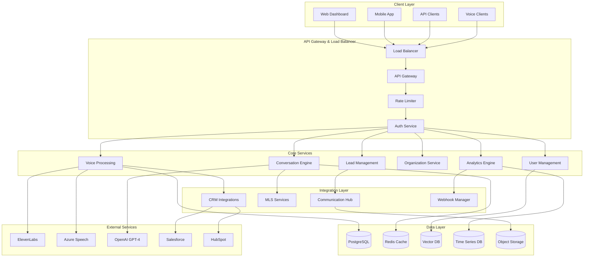
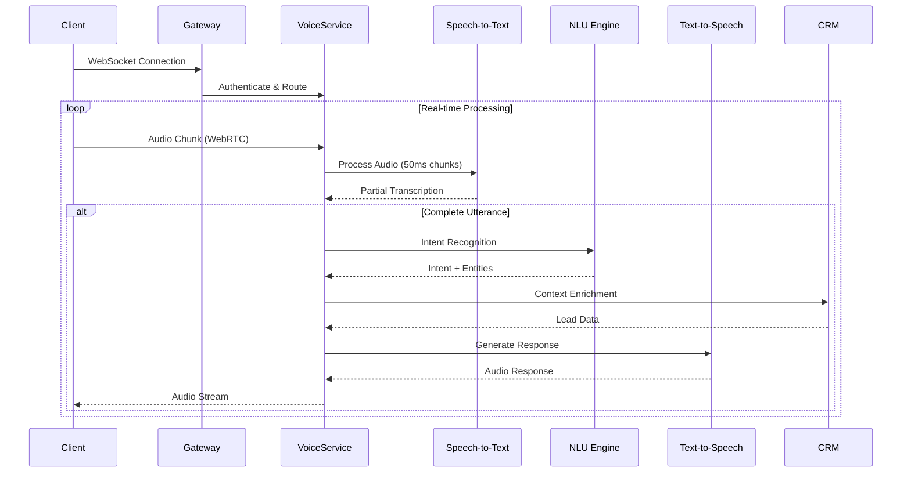

# Seiketsu AI Enterprise Voice Agent Platform - Backend API Architecture

**Version:** 1.0  
**Date:** August 4, 2025  
**Status:** Technical Architecture Design

## Executive Summary

This document defines the comprehensive backend API architecture for Seiketsu AI's enterprise voice agent platform, designed to support real-time voice processing with <180ms response times, multi-tenant operations for 1000+ concurrent sessions, and seamless enterprise integrations. The architecture leverages modern microservices patterns, event-driven design, and cloud-native scalability to deliver enterprise-grade voice AI solutions.

**Key Architectural Principles:**
- **Performance-First**: Sub-180ms voice processing pipeline
- **Multi-Tenant Security**: Complete data isolation and role-based access
- **Enterprise Integration**: Native CRM/MLS/Calendar connectivity
- **Compliance by Design**: TCPA, GDPR, SOC 2 Type II ready
- **Horizontal Scalability**: Auto-scaling microservices architecture

---

## 1. System Architecture Overview

### 1.1 High-Level Architecture



### 1.2 Service Architecture Principles

#### Microservices Design Patterns
- **Service Decomposition**: Domain-driven service boundaries
- **API-First Development**: Contract-first service design
- **Event-Driven Communication**: Asynchronous message passing
- **Circuit Breaker Pattern**: Fault tolerance and graceful degradation
- **Bulkhead Pattern**: Resource isolation and failure containment

#### Multi-Tenant Architecture
- **Data Isolation**: Database per tenant with shared infrastructure
- **Resource Partitioning**: CPU/Memory limits per tenant
- **Configuration Management**: Tenant-specific settings and customizations
- **Billing Integration**: Usage tracking and cost allocation
- **Security Boundaries**: Complete tenant data segregation

---

## 2. Core API Design

### 2.1 RESTful API Architecture

#### API Design Standards
```yaml
api_standards:
  versioning: "URI versioning (/api/v1/)"
  authentication: "Bearer token (JWT)"
  authorization: "Role-based access control (RBAC)"
  content_type: "application/json"
  response_format: "JSON API specification"
  error_handling: "RFC 7807 Problem Details"
  rate_limiting: "Token bucket algorithm"
  pagination: "Cursor-based pagination"
  filtering: "Query parameter filtering"
  sorting: "Multiple field sorting support"
```

#### Core API Endpoints Structure

**Authentication & Authorization**
```http
POST   /api/v1/auth/login
POST   /api/v1/auth/refresh
POST   /api/v1/auth/logout
GET    /api/v1/auth/me
PUT    /api/v1/auth/profile
```

**Organization Management**
```http
GET    /api/v1/organizations
POST   /api/v1/organizations
GET    /api/v1/organizations/{id}
PUT    /api/v1/organizations/{id}
DELETE /api/v1/organizations/{id}
GET    /api/v1/organizations/{id}/users
POST   /api/v1/organizations/{id}/users
```

**Voice Processing**
```http
POST   /api/v1/voice/sessions
GET    /api/v1/voice/sessions/{id}
PUT    /api/v1/voice/sessions/{id}
DELETE /api/v1/voice/sessions/{id}
POST   /api/v1/voice/transcribe
POST   /api/v1/voice/synthesize
GET    /api/v1/voice/sessions/{id}/recordings
```

**Lead Management**
```http
GET    /api/v1/leads
POST   /api/v1/leads
GET    /api/v1/leads/{id}
PUT    /api/v1/leads/{id}
DELETE /api/v1/leads/{id}
GET    /api/v1/leads/{id}/conversations
POST   /api/v1/leads/{id}/conversations
```

### 2.2 GraphQL Layer for Complex Queries

#### GraphQL Schema Design
```graphql
type Organization {
  id: ID!
  name: String!
  domain: String!
  settings: OrganizationSettings!
  users: [User!]!
  voiceAgents: [VoiceAgent!]!
  leads: [Lead!]!
  analytics: Analytics!
}

type VoiceSession {
  id: ID!
  organizationId: ID!
  leadId: ID
  agentId: ID!
  status: SessionStatus!
  startTime: DateTime!
  endTime: DateTime
  duration: Int
  transcript: [TranscriptEntry!]!
  recording: Recording
  analytics: SessionAnalytics!
}

type Lead {
  id: ID!
  organizationId: ID!
  firstName: String
  lastName: String
  email: String
  phone: String!
  source: LeadSource!
  status: LeadStatus!
  qualification: LeadQualification
  conversations: [Conversation!]!
  properties: [Property!]!
  activities: [Activity!]!
}

type Query {
  organization(id: ID!): Organization
  voiceSession(id: ID!): VoiceSession
  leads(filter: LeadFilter, pagination: Pagination): LeadConnection!
  analytics(filter: AnalyticsFilter): Analytics!
}

type Mutation {
  createVoiceSession(input: CreateVoiceSessionInput!): VoiceSession!
  updateLead(id: ID!, input: UpdateLeadInput!): Lead!
  syncCrmData(organizationId: ID!): SyncResult!
}

type Subscription {
  voiceSessionUpdates(sessionId: ID!): VoiceSession!
  leadUpdates(organizationId: ID!): Lead!
  systemEvents(organizationId: ID!): SystemEvent!
}
```

### 2.3 WebSocket Real-Time API

#### WebSocket Connection Management
```typescript
interface WebSocketAPI {
  // Connection lifecycle
  connect(token: string, organizationId: string): Promise<WebSocketConnection>
  disconnect(): void
  
  // Voice session events
  subscribeToVoiceSession(sessionId: string): void
  unsubscribeFromVoiceSession(sessionId: string): void
  
  // Real-time voice processing
  sendAudioChunk(sessionId: string, audioData: ArrayBuffer): void
  receiveTranscription(callback: (data: TranscriptionData) => void): void
  receiveAudioResponse(callback: (data: AudioData) => void): void
  
  // System events
  subscribeToSystemEvents(): void
  receiveSystemEvent(callback: (event: SystemEvent) => void): void
}

interface VoiceSessionEvents {
  'session.started': VoiceSessionStartedEvent
  'session.updated': VoiceSessionUpdatedEvent
  'session.ended': VoiceSessionEndedEvent
  'transcription.partial': PartialTranscriptionEvent
  'transcription.final': FinalTranscriptionEvent
  'audio.synthesized': AudioSynthesizedEvent
  'error.occurred': ErrorEvent
}
```

---

## 3. Voice Processing Pipeline Architecture

### 3.1 Real-Time Voice Processing Flow



### 3.2 Voice Processing Service Architecture

#### Voice Processing Engine
```python
class VoiceProcessingEngine:
    def __init__(self):
        self.stt_service = SpeechToTextService()
        self.nlu_engine = NLUEngine()
        self.conversation_manager = ConversationManager()
        self.tts_service = TextToSpeechService()
        self.audio_processor = AudioProcessor()
        
    async def process_audio_stream(
        self, 
        session_id: str, 
        audio_chunk: bytes
    ) -> VoiceResponse:
        # Step 1: Audio preprocessing
        processed_audio = await self.audio_processor.preprocess(audio_chunk)
        
        # Step 2: Speech-to-text (streaming)
        transcription = await self.stt_service.transcribe_streaming(
            processed_audio,
            session_id
        )
        
        # Step 3: Intent recognition and entity extraction
        if transcription.is_final:
            intent_result = await self.nlu_engine.process(
                transcription.text,
                session_id
            )
            
            # Step 4: Generate contextual response
            response = await self.conversation_manager.generate_response(
                intent_result,
                session_id
            )
            
            # Step 5: Text-to-speech synthesis
            audio_response = await self.tts_service.synthesize(
                response.text,
                session_id
            )
            
            return VoiceResponse(
                transcript=transcription.text,
                response_text=response.text,
                audio_data=audio_response,
                intent=intent_result.intent,
                confidence=intent_result.confidence,
                processing_time=response.processing_time
            )
```

#### Performance Optimization Strategies
- **Audio Chunk Processing**: 50ms audio chunks for real-time processing
- **Parallel Pipeline**: Concurrent STT, NLU, and TTS processing
- **Response Caching**: Cache common responses for faster delivery
- **Connection Pooling**: Reuse connections to external services
- **Load Balancing**: Distribute voice sessions across processing nodes

### 3.3 Voice Quality and Monitoring

#### Quality Metrics Tracking
```python
@dataclass
class VoiceQualityMetrics:
    session_id: str
    response_time_ms: int
    transcription_accuracy: float
    intent_confidence: float
    audio_quality_score: float
    noise_level: float
    echo_detected: bool
    processing_stages: Dict[str, int]  # Stage -> duration_ms
    
class VoiceQualityMonitor:
    async def track_session_quality(
        self, 
        session_id: str, 
        metrics: VoiceQualityMetrics
    ):
        # Real-time quality tracking
        await self.metrics_store.store(session_id, metrics)
        
        # Alert on quality degradation
        if metrics.response_time_ms > 200:
            await self.alert_manager.send_alert(
                AlertType.PERFORMANCE_DEGRADATION,
                f"Session {session_id} response time: {metrics.response_time_ms}ms"
            )
        
        # Quality analytics
        await self.analytics_engine.process_quality_metrics(metrics)
```

---

## 4. Multi-Tenant Architecture

### 4.1 Tenant Isolation Strategy

#### Database-Per-Tenant Architecture
```yaml
tenant_isolation:
  strategy: "Database per tenant with shared infrastructure"
  database_naming: "seiketsu_{tenant_id}"
  connection_pooling: "Per-tenant connection pools"
  schema_management: "Automated schema migration per tenant"
  backup_strategy: "Tenant-specific backup schedules"
  
tenant_metadata:
  storage: "Central metadata database"
  schema: |
    tenants:
      - id: uuid
      - name: string
      - domain: string
      - database_url: string
      - created_at: timestamp
      - settings: jsonb
      - subscription: subscription_info
```

#### Tenant-Aware Service Design
```python
class TenantAwareService:
    def __init__(self, tenant_resolver: TenantResolver):
        self.tenant_resolver = tenant_resolver
        
    async def get_database_session(self, request: Request) -> AsyncSession:
        tenant_id = await self.tenant_resolver.resolve_tenant(request)
        return await self.db_manager.get_session(tenant_id)
        
    async def get_tenant_config(self, tenant_id: str) -> TenantConfig:
        return await self.config_manager.get_config(tenant_id)

class TenantResolver:
    async def resolve_tenant(self, request: Request) -> str:
        # Multiple resolution strategies
        strategies = [
            self._resolve_from_subdomain,
            self._resolve_from_header,
            self._resolve_from_jwt_token,
            self._resolve_from_api_key
        ]
        
        for strategy in strategies:
            tenant_id = await strategy(request)
            if tenant_id:
                return tenant_id
                
        raise TenantNotFound("Unable to resolve tenant")
```

### 4.2 Resource Management and Scaling

#### Per-Tenant Resource Limits
```python
@dataclass
class TenantResourceLimits:
    max_concurrent_sessions: int = 100
    max_api_requests_per_minute: int = 1000
    max_storage_gb: int = 100
    max_voice_minutes_per_month: int = 10000
    max_integrations: int = 10
    
class TenantResourceManager:
    async def enforce_limits(
        self, 
        tenant_id: str, 
        resource_type: ResourceType,
        current_usage: int
    ) -> bool:
        limits = await self.get_tenant_limits(tenant_id)
        
        if resource_type == ResourceType.CONCURRENT_SESSIONS:
            return current_usage < limits.max_concurrent_sessions
        elif resource_type == ResourceType.API_REQUESTS:
            return await self.check_rate_limit(tenant_id, limits)
        
        return True
        
    async def track_usage(
        self, 
        tenant_id: str, 
        resource_type: ResourceType,
        amount: int
    ):
        await self.usage_store.increment(
            tenant_id, 
            resource_type, 
            amount,
            ttl=self.get_ttl(resource_type)
        )
```

### 4.3 Tenant Configuration Management

#### Dynamic Configuration System
```python
class TenantConfigurationService:
    async def get_voice_settings(self, tenant_id: str) -> VoiceSettings:
        config = await self.config_store.get(tenant_id, "voice_settings")
        return VoiceSettings(
            voice_model=config.get("voice_model", "elevenlabs_adam"),
            response_speed=config.get("response_speed", 1.0),
            language=config.get("language", "en-US"),
            custom_prompts=config.get("custom_prompts", {}),
            escalation_rules=config.get("escalation_rules", [])
        )
    
    async def get_integration_settings(
        self, 
        tenant_id: str
    ) -> IntegrationSettings:
        return IntegrationSettings(
            crm_configs=await self.get_crm_configs(tenant_id),
            mls_configs=await self.get_mls_configs(tenant_id),
            webhook_endpoints=await self.get_webhook_configs(tenant_id),
            notification_settings=await self.get_notification_configs(tenant_id)
        )
```

---

## 5. Enterprise Integrations

### 5.1 CRM Integration Architecture

#### Universal CRM Adapter Pattern
```python
class CRMIntegrationManager:
    def __init__(self):
        self.adapters = {
            'salesforce': SalesforceAdapter(),
            'hubspot': HubSpotAdapter(),
            'zoho': ZohoAdapter(),
            'pipedrive': PipedriveAdapter()
        }
    
    async def create_lead(
        self, 
        tenant_id: str, 
        lead_data: LeadData
    ) -> CRMResponse:
        crm_config = await self.config_service.get_crm_config(tenant_id)
        adapter = self.adapters[crm_config.type]
        
        return await adapter.create_lead(
            credentials=crm_config.credentials,
            lead_data=lead_data,
            field_mapping=crm_config.field_mapping
        )

class SalesforceAdapter(CRMAdapter):
    async def create_lead(
        self, 
        credentials: SalesforceCredentials,
        lead_data: LeadData,
        field_mapping: Dict[str, str]
    ) -> CRMResponse:
        client = await self.get_client(credentials)
        
        # Map Seiketsu fields to Salesforce fields
        sf_data = self.map_fields(lead_data, field_mapping)
        
        # Create lead with retry logic
        result = await self.retry_with_backoff(
            client.Lead.create,
            sf_data
        )
        
        return CRMResponse(
            success=True,
            external_id=result['id'],
            message="Lead created successfully"
        )
```

#### CRM Synchronization Engine
```python
class CRMSyncEngine:
    async def sync_lead_data(
        self, 
        tenant_id: str, 
        lead_id: str
    ) -> SyncResult:
        # Get lead data from our system
        lead = await self.lead_service.get_lead(tenant_id, lead_id)
        
        # Get CRM configuration
        crm_config = await self.config_service.get_crm_config(tenant_id)
        
        # Bidirectional sync
        sync_tasks = [
            self.sync_to_crm(lead, crm_config),
            self.sync_from_crm(lead, crm_config)
        ]
        
        results = await asyncio.gather(*sync_tasks, return_exceptions=True)
        
        return SyncResult(
            lead_id=lead_id,
            to_crm_success=not isinstance(results[0], Exception),
            from_crm_success=not isinstance(results[1], Exception),
            sync_timestamp=datetime.utcnow()
        )
    
    async def setup_webhook_sync(
        self, 
        tenant_id: str, 
        crm_type: str
    ):
        """Setup bidirectional webhook synchronization"""
        webhook_url = f"{self.base_url}/api/v1/webhooks/crm/{crm_type}/{tenant_id}"
        
        await self.crm_adapters[crm_type].setup_webhooks(
            tenant_id=tenant_id,
            webhook_url=webhook_url,
            events=['lead.created', 'lead.updated', 'opportunity.updated']
        )
```

### 5.2 MLS Integration Services

#### MLS Data Pipeline
```python
class MLSIntegrationService:
    async def search_properties(
        self, 
        tenant_id: str, 
        search_criteria: PropertySearchCriteria
    ) -> PropertySearchResults:
        # Get MLS access for tenant
        mls_config = await self.config_service.get_mls_config(tenant_id)
        
        # Multiple MLS sources
        search_tasks = []
        for mls_provider in mls_config.providers:
            search_tasks.append(
                self.search_single_mls(mls_provider, search_criteria)
            )
        
        # Aggregate results from multiple MLS sources
        results = await asyncio.gather(*search_tasks, return_exceptions=True)
        
        # Deduplicate and rank properties
        aggregated_results = self.aggregate_property_results(results)
        
        return PropertySearchResults(
            properties=aggregated_results,
            total_count=len(aggregated_results),
            search_criteria=search_criteria,
            mls_sources=[r.source for r in results if not isinstance(r, Exception)]
        )
    
    async def get_property_details(
        self, 
        tenant_id: str, 
        mls_number: str
    ) -> PropertyDetails:
        # Real-time property data enrichment
        property_data = await self.mls_adapter.get_property(mls_number)
        
        # Enrich with additional data
        enrichment_tasks = [
            self.get_neighborhood_data(property_data.address),
            self.get_market_analytics(property_data.address),
            self.get_comparable_sales(property_data),
            self.get_school_information(property_data.address)
        ]
        
        enrichment_data = await asyncio.gather(*enrichment_tasks)
        
        return PropertyDetails(
            mls_data=property_data,
            neighborhood_data=enrichment_data[0],
            market_analytics=enrichment_data[1],
            comparable_sales=enrichment_data[2],
            school_information=enrichment_data[3]
        )
```

### 5.3 Communication Platform Integration

#### Unified Communication Hub
```python
class CommunicationHub:
    def __init__(self):
        self.channels = {
            'voice': VoiceChannel(),
            'sms': SMSChannel(),
            'email': EmailChannel(),
            'video': VideoChannel()
        }
    
    async def send_message(
        self, 
        tenant_id: str,
        lead_id: str,
        message: Message
    ) -> MessageResult:
        # Get lead's preferred communication method
        lead = await self.lead_service.get_lead(tenant_id, lead_id)
        channel = self.select_optimal_channel(lead, message)
        
        # Send message through appropriate channel
        result = await self.channels[channel].send(
            recipient=lead.contact_info,
            message=message,
            tenant_config=await self.get_tenant_config(tenant_id)
        )
        
        # Track message delivery
        await self.message_tracker.track_delivery(
            tenant_id=tenant_id,
            lead_id=lead_id,
            message_id=result.message_id,
            channel=channel,
            status=result.status
        )
        
        return result

class SMSChannel(CommunicationChannel):
    async def send(
        self, 
        recipient: ContactInfo, 
        message: Message,
        tenant_config: TenantConfig
    ) -> MessageResult:
        # TCPA compliance check
        if not await self.compliance_checker.check_sms_consent(
            recipient.phone, 
            tenant_config.tenant_id
        ):
            raise ComplianceError("SMS consent not found")
        
        # Send via Twilio
        result = await self.twilio_client.messages.create(
            to=recipient.phone,
            from_=tenant_config.sms_phone_number,
            body=message.text
        )
        
        return MessageResult(
            message_id=result.sid,
            status=MessageStatus.SENT,
            channel='sms',
            timestamp=datetime.utcnow()
        )
```

---

## 6. Data Architecture

### 6.1 Database Design

#### Primary Database Schema (PostgreSQL)
```sql
-- Organizations and multi-tenancy
CREATE TABLE organizations (
    id UUID PRIMARY KEY DEFAULT gen_random_uuid(),
    name VARCHAR(255) NOT NULL,
    domain VARCHAR(255) UNIQUE NOT NULL,
    settings JSONB NOT NULL DEFAULT '{}',
    subscription_tier VARCHAR(50) NOT NULL DEFAULT 'starter',
    created_at TIMESTAMPTZ NOT NULL DEFAULT NOW(),
    updated_at TIMESTAMPTZ NOT NULL DEFAULT NOW()
);

-- Users and authentication
CREATE TABLE users (
    id UUID PRIMARY KEY DEFAULT gen_random_uuid(),
    organization_id UUID NOT NULL REFERENCES organizations(id) ON DELETE CASCADE,
    email VARCHAR(255) NOT NULL,
    first_name VARCHAR(100),
    last_name VARCHAR(100),
    role VARCHAR(50) NOT NULL DEFAULT 'agent',
    password_hash VARCHAR(255) NOT NULL,
    is_active BOOLEAN NOT NULL DEFAULT true,
    last_login_at TIMESTAMPTZ,
    created_at TIMESTAMPTZ NOT NULL DEFAULT NOW(),
    updated_at TIMESTAMPTZ NOT NULL DEFAULT NOW(),
    UNIQUE(organization_id, email)
);

-- Voice sessions
CREATE TABLE voice_sessions (
    id UUID PRIMARY KEY DEFAULT gen_random_uuid(),
    organization_id UUID NOT NULL REFERENCES organizations(id) ON DELETE CASCADE,
    lead_id UUID REFERENCES leads(id) ON DELETE SET NULL,
    agent_id UUID REFERENCES users(id) ON DELETE SET NULL,
    phone_number VARCHAR(20) NOT NULL,
    session_type VARCHAR(20) NOT NULL DEFAULT 'inbound',
    status VARCHAR(20) NOT NULL DEFAULT 'active',
    started_at TIMESTAMPTZ NOT NULL DEFAULT NOW(),
    ended_at TIMESTAMPTZ,
    duration_seconds INTEGER,
    transcript JSONB,
    recording_url VARCHAR(500),
    quality_metrics JSONB,
    created_at TIMESTAMPTZ NOT NULL DEFAULT NOW()
);

-- Leads management
CREATE TABLE leads (
    id UUID PRIMARY KEY DEFAULT gen_random_uuid(),
    organization_id UUID NOT NULL REFERENCES organizations(id) ON DELETE CASCADE,
    first_name VARCHAR(100),
    last_name VARCHAR(100),
    email VARCHAR(255),
    phone VARCHAR(20) NOT NULL,
    source VARCHAR(100) NOT NULL,
    status VARCHAR(50) NOT NULL DEFAULT 'new',
    qualification JSONB,
    crm_sync_status VARCHAR(20) DEFAULT 'pending',
    crm_external_id VARCHAR(100),
    created_at TIMESTAMPTZ NOT NULL DEFAULT NOW(),
    updated_at TIMESTAMPTZ NOT NULL DEFAULT NOW()
);

-- Conversations and interactions
CREATE TABLE conversations (
    id UUID PRIMARY KEY DEFAULT gen_random_uuid(),
    lead_id UUID NOT NULL REFERENCES leads(id) ON DELETE CASCADE,
    voice_session_id UUID REFERENCES voice_sessions(id) ON DELETE SET NULL,
    channel VARCHAR(20) NOT NULL, -- voice, sms, email
    direction VARCHAR(10) NOT NULL, -- inbound, outbound
    content JSONB NOT NULL,
    metadata JSONB,
    created_at TIMESTAMPTZ NOT NULL DEFAULT NOW()
);

-- CRM integrations
CREATE TABLE crm_integrations (
    id UUID PRIMARY KEY DEFAULT gen_random_uuid(),
    organization_id UUID NOT NULL REFERENCES organizations(id) ON DELETE CASCADE,
    crm_type VARCHAR(50) NOT NULL, -- salesforce, hubspot, zoho
    credentials JSONB NOT NULL, -- encrypted
    field_mapping JSONB NOT NULL DEFAULT '{}',
    webhook_config JSONB,
    sync_enabled BOOLEAN NOT NULL DEFAULT true,
    last_sync_at TIMESTAMPTZ,
    created_at TIMESTAMPTZ NOT NULL DEFAULT NOW(),
    updated_at TIMESTAMPTZ NOT NULL DEFAULT NOW()
);

-- Indexes for performance
CREATE INDEX idx_voice_sessions_org_status ON voice_sessions(organization_id, status);
CREATE INDEX idx_leads_org_status ON leads(organization_id, status);
CREATE INDEX idx_leads_phone ON leads(phone);
CREATE INDEX idx_conversations_lead_created ON conversations(lead_id, created_at);
CREATE INDEX idx_users_org_role ON users(organization_id, role);
```

### 6.2 Caching Strategy (Redis)

#### Cache Architecture
```python
class CacheManager:
    def __init__(self):
        self.redis_client = redis.Redis(
            connection_pool=redis.ConnectionPool(
                host=settings.REDIS_HOST,
                port=settings.REDIS_PORT,
                db=0,
                max_connections=100
            )
        )
    
    # Session-based caching
    async def cache_voice_session(
        self, 
        session_id: str, 
        session_data: VoiceSessionData,
        ttl: int = 3600
    ):
        key = f"voice_session:{session_id}"
        await self.redis_client.setex(
            key, 
            ttl, 
            json.dumps(session_data.dict())
        )
    
    # Conversation context caching
    async def cache_conversation_context(
        self, 
        session_id: str, 
        context: ConversationContext,
        ttl: int = 1800
    ):
        key = f"conversation_context:{session_id}"
        await self.redis_client.setex(
            key, 
            ttl, 
            json.dumps(context.dict())
        )
    
    # CRM data caching
    async def cache_crm_data(
        self, 
        tenant_id: str, 
        external_id: str,
        data: Dict,
        ttl: int = 300
    ):
        key = f"crm_data:{tenant_id}:{external_id}"
        await self.redis_client.setex(
            key, 
            ttl, 
            json.dumps(data)
        )
    
    # Rate limiting
    async def check_rate_limit(
        self, 
        identifier: str, 
        limit: int, 
        window: int
    ) -> bool:
        key = f"rate_limit:{identifier}"
        current = await self.redis_client.incr(key)
        
        if current == 1:
            await self.redis_client.expire(key, window)
        
        return current <= limit
```

### 6.3 Vector Database for Voice Embeddings

#### Vector Search for Voice Intelligence
```python
class VoiceEmbeddingService:
    def __init__(self):
        self.vector_db = pinecone.Index("voice-embeddings")
        self.embedding_model = SentenceTransformer('sentence-transformers/all-MiniLM-L6-v2')
    
    async def store_conversation_embedding(
        self, 
        session_id: str,
        conversation_text: str,
        metadata: Dict
    ):
        # Generate embedding
        embedding = self.embedding_model.encode(conversation_text).tolist()
        
        # Store in vector database
        await self.vector_db.upsert([
            {
                'id': session_id,
                'values': embedding,
                'metadata': {
                    'tenant_id': metadata.get('tenant_id'),
                    'conversation_date': metadata.get('date'),
                    'lead_qualification': metadata.get('qualification'),
                    'outcome': metadata.get('outcome')
                }
            }
        ])
    
    async def find_similar_conversations(
        self, 
        query_text: str,
        tenant_id: str,
        top_k: int = 10
    ) -> List[SimilarConversation]:
        # Generate query embedding
        query_embedding = self.embedding_model.encode(query_text).tolist()
        
        # Search similar conversations
        results = await self.vector_db.query(
            vector=query_embedding,
            top_k=top_k,
            filter={'tenant_id': tenant_id},
            include_metadata=True
        )
        
        return [
            SimilarConversation(
                session_id=match['id'],
                similarity_score=match['score'],
                metadata=match['metadata']
            )
            for match in results['matches']
        ]
```

### 6.4 Time-Series Database for Analytics

#### Analytics Data Pipeline
```python
class AnalyticsDataPipeline:
    def __init__(self):
        self.influxdb_client = InfluxDBClient(
            url=settings.INFLUXDB_URL,
            token=settings.INFLUXDB_TOKEN
        )
        self.write_api = self.influxdb_client.write_api()
    
    async def record_voice_metrics(
        self, 
        session_id: str,
        tenant_id: str,
        metrics: VoiceMetrics
    ):
        # Write voice quality metrics
        point = Point("voice_quality") \
            .tag("tenant_id", tenant_id) \
            .tag("session_id", session_id) \
            .field("response_time_ms", metrics.response_time_ms) \
            .field("transcription_accuracy", metrics.transcription_accuracy) \
            .field("intent_confidence", metrics.intent_confidence) \
            .field("audio_quality_score", metrics.audio_quality_score) \
            .time(datetime.utcnow())
        
        await self.write_api.write(bucket="voice_metrics", record=point)
    
    async def record_business_metrics(
        self, 
        tenant_id: str,
        metrics: BusinessMetrics
    ):
        # Write business KPIs
        points = [
            Point("lead_metrics") \
                .tag("tenant_id", tenant_id) \
                .field("leads_created", metrics.leads_created) \
                .field("leads_qualified", metrics.leads_qualified) \
                .field("appointments_booked", metrics.appointments_booked) \
                .time(datetime.utcnow()),
            
            Point("agent_metrics") \
                .tag("tenant_id", tenant_id) \
                .field("active_agents", metrics.active_agents) \
                .field("avg_session_duration", metrics.avg_session_duration) \
                .field("conversion_rate", metrics.conversion_rate) \
                .time(datetime.utcnow())
        ]
        
        await self.write_api.write(bucket="business_metrics", records=points)
```

---

## 7. Security & Compliance Framework

### 7.1 Authentication & Authorization

#### JWT-Based Authentication
```python
class AuthenticationService:
    def __init__(self):
        self.jwt_secret = settings.JWT_SECRET_KEY
        self.jwt_algorithm = "HS256"
        self.token_expire_minutes = 30
    
    async def authenticate_user(
        self, 
        email: str, 
        password: str,
        organization_domain: str
    ) -> AuthResult:
        # Verify organization
        org = await self.org_service.get_by_domain(organization_domain)
        if not org:
            raise AuthenticationError("Invalid organization")
        
        # Verify user credentials
        user = await self.user_service.authenticate(
            organization_id=org.id,
            email=email,
            password=password
        )
        
        if not user:
            raise AuthenticationError("Invalid credentials")
        
        # Generate tokens
        access_token = self.create_access_token(user)
        refresh_token = self.create_refresh_token(user)
        
        return AuthResult(
            user=user,
            access_token=access_token,
            refresh_token=refresh_token,
            expires_in=self.token_expire_minutes * 60
        )
    
    def create_access_token(self, user: User) -> str:
        payload = {
            'user_id': str(user.id),
            'organization_id': str(user.organization_id),
            'role': user.role,
            'exp': datetime.utcnow() + timedelta(minutes=self.token_expire_minutes),
            'iat': datetime.utcnow(),
            'type': 'access'
        }
        
        return jwt.encode(payload, self.jwt_secret, algorithm=self.jwt_algorithm)
```

#### Role-Based Access Control (RBAC)
```python
class RBACService:
    def __init__(self):
        self.permissions = {
            'super_admin': [
                'organization.create', 'organization.read', 'organization.update', 'organization.delete',
                'user.create', 'user.read', 'user.update', 'user.delete',
                'voice.read', 'voice.manage', 'lead.read', 'lead.manage',
                'integration.read', 'integration.manage', 'analytics.read'
            ],
            'org_admin': [
                'organization.read', 'organization.update',
                'user.create', 'user.read', 'user.update',
                'voice.read', 'voice.manage', 'lead.read', 'lead.manage',
                'integration.read', 'integration.manage', 'analytics.read'
            ],
            'manager': [
                'user.read', 'voice.read', 'lead.read', 'lead.manage',
                'analytics.read'
            ],
            'agent': [
                'voice.read', 'lead.read', 'lead.update'
            ]
        }
    
    def check_permission(
        self, 
        user_role: str, 
        required_permission: str
    ) -> bool:
        user_permissions = self.permissions.get(user_role, [])
        return required_permission in user_permissions
    
    def require_permission(self, permission: str):
        def decorator(func):
            @wraps(func)
            async def wrapper(*args, **kwargs):
                # Extract user from request context
                user = get_current_user()
                
                if not self.check_permission(user.role, permission):
                    raise PermissionDenied(f"Permission '{permission}' required")
                
                return await func(*args, **kwargs)
            return wrapper
        return decorator
```

### 7.2 TCPA Compliance Automation

#### Consent Management System
```python
class TCPAComplianceService:
    async def record_consent(
        self, 
        phone_number: str,
        consent_type: ConsentType,
        tenant_id: str,
        metadata: Dict = None
    ) -> ConsentRecord:
        consent_record = ConsentRecord(
            phone_number=phone_number,
            tenant_id=tenant_id,
            consent_type=consent_type,
            granted_at=datetime.utcnow(),
            metadata=metadata or {},
            source='voice_interaction'
        )
        
        await self.consent_store.save(consent_record)
        
        # Real-time DNC list check
        is_on_dnc = await self.dnc_service.check_phone_number(phone_number)
        if is_on_dnc:
            await self.alert_service.send_alert(
                AlertType.DNC_VIOLATION_RISK,
                f"Phone {phone_number} is on DNC list"
            )
        
        return consent_record
    
    async def check_call_permission(
        self, 
        phone_number: str,
        tenant_id: str,
        call_type: CallType
    ) -> CallPermissionResult:
        # Check consent records
        consent = await self.consent_store.get_latest_consent(
            phone_number, 
            tenant_id
        )
        
        # Check DNC list
        is_on_dnc = await self.dnc_service.check_phone_number(phone_number)
        
        # Apply TCPA rules
        permission_result = self.evaluate_tcpa_rules(
            consent=consent,
            is_on_dnc=is_on_dnc,
            call_type=call_type
        )
        
        # Log compliance check
        await self.compliance_logger.log_permission_check(
            phone_number=phone_number,
            tenant_id=tenant_id,
            result=permission_result,
            timestamp=datetime.utcnow()
        )
        
        return permission_result
```

### 7.3 Data Encryption and Security

#### Encryption Service
```python
class EncryptionService:
    def __init__(self):
        self.key_manager = AWSKeyManagementService()
        self.cipher_suite = Fernet(self.get_encryption_key())
    
    async def encrypt_sensitive_data(self, data: str) -> str:
        """Encrypt PII and sensitive data"""
        encrypted_data = self.cipher_suite.encrypt(data.encode())
        return base64.b64encode(encrypted_data).decode()
    
    async def decrypt_sensitive_data(self, encrypted_data: str) -> str:
        """Decrypt PII and sensitive data"""
        decoded_data = base64.b64decode(encrypted_data.encode())
        decrypted_data = self.cipher_suite.decrypt(decoded_data)
        return decrypted_data.decode()
    
    async def encrypt_voice_recording(
        self, 
        recording_data: bytes,
        session_id: str
    ) -> str:
        """Encrypt voice recordings with session-specific key"""
        session_key = await self.key_manager.generate_data_key(session_id)
        cipher = Fernet(session_key)
        
        encrypted_recording = cipher.encrypt(recording_data)
        
        # Store encrypted recording in S3
        s3_key = f"recordings/{session_id}/encrypted_recording.dat"
        await self.s3_client.put_object(
            Bucket=settings.RECORDINGS_BUCKET,
            Key=s3_key,
            Body=encrypted_recording,
            ServerSideEncryption='aws:kms',
            SSEKMSKeyId=settings.KMS_KEY_ID
        )
        
        return s3_key
```

---

## 8. Performance & Scalability

### 8.1 Performance Requirements

#### Response Time Optimization
```python
class PerformanceOptimizer:
    def __init__(self):
        self.target_response_time = 180  # milliseconds
        self.performance_tracker = PerformanceTracker()
    
    async def optimize_voice_pipeline(
        self, 
        session_id: str
    ) -> VoicePipelineOptimizer:
        return VoicePipelineOptimizer(
            # Parallel processing stages
            stt_processor=STTProcessor(
                chunk_size=50,  # 50ms chunks
                parallel_processing=True
            ),
            nlu_processor=NLUProcessor(
                cache_enabled=True,
                model_optimization=True
            ),
            tts_processor=TTSProcessor(
                voice_caching=True,
                streaming_enabled=True
            ),
            
            # Performance monitoring
            metrics_collector=self.performance_tracker,
            target_latency=self.target_response_time
        )
    
    async def monitor_performance(self, session_id: str):
        """Real-time performance monitoring"""
        metrics = await self.performance_tracker.get_session_metrics(session_id)
        
        if metrics.avg_response_time > self.target_response_time:
            # Auto-scaling trigger
            await self.scaling_service.scale_voice_processors()
            
            # Performance alert
            await self.alert_service.send_performance_alert(
                session_id=session_id,
                current_latency=metrics.avg_response_time,
                target_latency=self.target_response_time
            )
```

### 8.2 Auto-Scaling Architecture

#### Kubernetes-Based Scaling
```yaml
# voice-processing-deployment.yaml
apiVersion: apps/v1
kind: Deployment
metadata:
  name: voice-processing-service
spec:
  replicas: 3
  selector:
    matchLabels:
      app: voice-processing
  template:
    metadata:
      labels:
        app: voice-processing
    spec:
      containers:
      - name: voice-processor
        image: seiketsu/voice-processor:latest
        ports:
        - containerPort: 8000
        resources:
          requests:
            memory: "512Mi"
            cpu: "500m"
          limits:
            memory: "1Gi"
            cpu: "1000m"
        env:
        - name: REDIS_URL
          value: "redis://redis-service:6379"
        - name: DATABASE_URL
          valueFrom:
            secretKeyRef:
              name: db-credentials
              key: url

---
apiVersion: autoscaling/v2
kind: HorizontalPodAutoscaler
metadata:
  name: voice-processing-hpa
spec:
  scaleTargetRef:
    apiVersion: apps/v1
    kind: Deployment
    name: voice-processing-service
  minReplicas: 3
  maxReplicas: 20
  metrics:
  - type: Resource
    resource:
      name: cpu
      target:
        type: Utilization
        averageUtilization: 70
  - type: Resource
    resource:
      name: memory
      target:
        type: Utilization
        averageUtilization: 80
  - type: Pods
    pods:
      metric:
        name: voice_sessions_per_pod
      target:
        type: AverageValue
        averageValue: "50"
```

### 8.3 Load Balancing Strategy

#### Intelligent Load Balancing
```python
class IntelligentLoadBalancer:
    def __init__(self):
        self.health_checker = HealthChecker()
        self.performance_tracker = PerformanceTracker()
        self.session_affinity = SessionAffinityManager()
    
    async def route_voice_session(
        self, 
        session_request: VoiceSessionRequest
    ) -> ServiceEndpoint:
        # Get available voice processing nodes
        available_nodes = await self.get_healthy_nodes()
        
        # Check for session affinity
        if session_request.session_id:
            affinity_node = await self.session_affinity.get_preferred_node(
                session_request.session_id
            )
            if affinity_node and affinity_node in available_nodes:
                return affinity_node
        
        # Intelligent routing based on multiple factors
        optimal_node = await self.select_optimal_node(
            available_nodes=available_nodes,
            tenant_id=session_request.tenant_id,
            geographic_region=session_request.region,
            session_complexity=session_request.complexity_score
        )
        
        # Establish session affinity
        await self.session_affinity.set_preferred_node(
            session_request.session_id,
            optimal_node
        )
        
        return optimal_node
    
    async def select_optimal_node(
        self,
        available_nodes: List[ServiceNode],
        tenant_id: str,
        geographic_region: str,
        session_complexity: int
    ) -> ServiceNode:
        # Score each node based on multiple criteria
        node_scores = []
        
        for node in available_nodes:
            score = await self.calculate_node_score(
                node=node,
                tenant_id=tenant_id,
                geographic_region=geographic_region,
                session_complexity=session_complexity
            )
            node_scores.append((node, score))
        
        # Return node with highest score
        return max(node_scores, key=lambda x: x[1])[0]
```

---

## 9. Monitoring & Observability

### 9.1 Application Performance Monitoring

#### Comprehensive Monitoring Stack
```python
class MonitoringService:
    def __init__(self):
        self.prometheus_client = PrometheusClient()
        self.jaeger_tracer = JaegerTracer()
        self.datadog_client = DatadogClient()
    
    async def track_voice_session_metrics(
        self, 
        session_id: str,
        metrics: VoiceSessionMetrics
    ):
        # Prometheus metrics
        self.prometheus_client.histogram(
            'voice_response_time_seconds',
            metrics.response_time_ms / 1000,
            labels={
                'tenant_id': metrics.tenant_id,
                'session_type': metrics.session_type
            }
        )
        
        self.prometheus_client.counter(
            'voice_sessions_total',
            labels={
                'tenant_id': metrics.tenant_id,
                'status': metrics.status
            }
        ).inc()
        
        # Distributed tracing
        with self.jaeger_tracer.start_span(
            'voice_session_processing',
            tags={
                'session_id': session_id,
                'tenant_id': metrics.tenant_id
            }
        ) as span:
            span.set_tag('response_time_ms', metrics.response_time_ms)
            span.set_tag('intent_confidence', metrics.intent_confidence)
        
        # Custom business metrics
        await self.datadog_client.increment(
            'seiketsu.voice.sessions.processed',
            tags=[
                f'tenant:{metrics.tenant_id}',
                f'status:{metrics.status}'
            ]
        )
```

### 9.2 Health Checks and Alerts

#### Comprehensive Health Monitoring
```python
class HealthCheckService:
    async def perform_health_checks(self) -> HealthStatus:
        checks = [
            self.check_database_connectivity(),
            self.check_redis_connectivity(),
            self.check_external_services(),
            self.check_voice_processing_pipeline(),
            self.check_integration_services()
        ]
        
        results = await asyncio.gather(*checks, return_exceptions=True)
        
        return HealthStatus(
            overall_status=self.determine_overall_status(results),
            individual_checks=results,
            timestamp=datetime.utcnow()
        )
    
    async def check_voice_processing_pipeline(self) -> HealthCheckResult:
        """Test end-to-end voice processing"""
        try:
            # Test with sample audio
            test_audio = self.get_test_audio_sample()
            
            start_time = time.time()
            result = await self.voice_processor.process_test_audio(test_audio)
            end_time = time.time()
            
            response_time = (end_time - start_time) * 1000  # Convert to ms
            
            return HealthCheckResult(
                service='voice_processing',
                status='healthy' if response_time < 200 else 'degraded',
                response_time_ms=response_time,
                details={
                    'transcription_accuracy': result.accuracy,
                    'intent_confidence': result.confidence
                }
            )
        except Exception as e:
            return HealthCheckResult(
                service='voice_processing',
                status='unhealthy',
                error=str(e)
            )
```

### 9.3 Business Intelligence Dashboard

#### Real-Time Analytics Dashboard
```python
class BusinessIntelligenceDashboard:
    async def get_real_time_metrics(
        self, 
        tenant_id: str,
        time_range: TimeRange
    ) -> DashboardMetrics:
        # Concurrent data fetching
        tasks = [
            self.get_voice_session_metrics(tenant_id, time_range),
            self.get_lead_conversion_metrics(tenant_id, time_range),
            self.get_agent_performance_metrics(tenant_id, time_range),
            self.get_system_performance_metrics(tenant_id, time_range),
            self.get_compliance_metrics(tenant_id, time_range)
        ]
        
        results = await asyncio.gather(*tasks)
        
        return DashboardMetrics(
            voice_metrics=results[0],
            conversion_metrics=results[1],
            agent_metrics=results[2],
            system_metrics=results[3],
            compliance_metrics=results[4],
            generated_at=datetime.utcnow()
        )
    
    async def get_voice_session_metrics(
        self, 
        tenant_id: str,
        time_range: TimeRange
    ) -> VoiceMetrics:
        query = f"""
        SELECT 
            COUNT(*) as total_sessions,
            AVG(duration_seconds) as avg_duration,
            AVG(CAST(quality_metrics->>'response_time_ms' AS INTEGER)) as avg_response_time,
            AVG(CAST(quality_metrics->>'transcription_accuracy' AS FLOAT)) as avg_accuracy,
            COUNT(*) FILTER (WHERE status = 'completed') as completed_sessions,
            COUNT(*) FILTER (WHERE status = 'escalated') as escalated_sessions
        FROM voice_sessions 
        WHERE organization_id = %s 
        AND started_at >= %s 
        AND started_at <= %s
        """
        
        result = await self.db.fetch_one(
            query, 
            tenant_id, 
            time_range.start, 
            time_range.end
        )
        
        return VoiceMetrics(
            total_sessions=result['total_sessions'],
            avg_duration_seconds=result['avg_duration'],
            avg_response_time_ms=result['avg_response_time'],
            avg_transcription_accuracy=result['avg_accuracy'],
            completion_rate=result['completed_sessions'] / result['total_sessions'],
            escalation_rate=result['escalated_sessions'] / result['total_sessions']
        )
```

---

## 10. Deployment Strategy

### 10.1 Cloud-Native Architecture

#### Infrastructure as Code (Terraform)
```hcl
# main.tf
provider "aws" {
  region = var.aws_region
}

# EKS Cluster
module "eks" {
  source = "terraform-aws-modules/eks/aws"
  
  cluster_name    = "seiketsu-${var.environment}"
  cluster_version = "1.28"
  
  vpc_id     = module.vpc.vpc_id
  subnet_ids = module.vpc.private_subnets
  
  eks_managed_node_groups = {
    voice_processing = {
      instance_types = ["c5.xlarge"]
      min_size      = 3
      max_size      = 20
      desired_size  = 5
      
      labels = {
        workload = "voice-processing"
      }
      
      taints = {
        voice-processing = {
          key    = "workload"
          value  = "voice-processing"
          effect = "NO_SCHEDULE"
        }
      }
    }
    
    general_workloads = {
      instance_types = ["t3.large"]
      min_size      = 2
      max_size      = 10
      desired_size  = 3
    }
  }
}

# RDS PostgreSQL
resource "aws_db_instance" "main" {
  identifier = "seiketsu-${var.environment}"
  
  engine         = "postgres"
  engine_version = "15.4"
  instance_class = "db.r5.xlarge"
  
  allocated_storage     = 100
  max_allocated_storage = 1000
  
  db_name  = "seiketsu"
  username = var.db_username
  password = var.db_password
  
  vpc_security_group_ids = [aws_security_group.rds.id]
  db_subnet_group_name   = aws_db_subnet_group.main.name
  
  backup_retention_period = 7
  backup_window          = "03:00-04:00"
  maintenance_window     = "sun:04:00-sun:05:00"
  
  performance_insights_enabled = true
  monitoring_interval         = 60
  
  tags = {
    Environment = var.environment
    Application = "seiketsu"
  }
}

# ElastiCache Redis
resource "aws_elasticache_replication_group" "main" {
  replication_group_id       = "seiketsu-${var.environment}"
  description                = "Redis cluster for Seiketsu AI"
  
  node_type                  = "cache.r6g.large"
  port                       = 6379
  parameter_group_name       = "default.redis7"
  
  num_cache_clusters         = 3
  automatic_failover_enabled = true
  multi_az_enabled          = true
  
  subnet_group_name = aws_elasticache_subnet_group.main.name
  security_group_ids = [aws_security_group.redis.id]
  
  at_rest_encryption_enabled = true
  transit_encryption_enabled = true
  
  tags = {
    Environment = var.environment
    Application = "seiketsu"
  }
}
```

### 10.2 CI/CD Pipeline

#### GitHub Actions Workflow
```yaml
# .github/workflows/deploy.yml
name: Deploy Seiketsu AI API

on:
  push:
    branches: [main, staging]
  pull_request:
    branches: [main]

env:
  REGISTRY: ghcr.io
  IMAGE_NAME: seiketsu/api

jobs:
  test:
    runs-on: ubuntu-latest
    services:
      postgres:
        image: postgres:15
        env:
          POSTGRES_PASSWORD: postgres
          POSTGRES_DB: test_seiketsu
        options: >-
          --health-cmd pg_isready
          --health-interval 10s
          --health-timeout 5s
          --health-retries 5
      
      redis:
        image: redis:7
        options: >-
          --health-cmd "redis-cli ping"
          --health-interval 10s
          --health-timeout 5s
          --health-retries 5
    
    steps:
    - uses: actions/checkout@v4
    
    - name: Set up Python
      uses: actions/setup-python@v4
      with:
        python-version: '3.11'
    
    - name: Install dependencies
      run: |
        pip install -r requirements.txt
        pip install -r requirements-test.txt
    
    - name: Run tests
      run: |
        pytest --cov=app --cov-report=xml
        
    - name: Upload coverage
      uses: codecov/codecov-action@v3
      with:
        file: ./coverage.xml

  build-and-push:
    needs: test
    runs-on: ubuntu-latest
    if: github.event_name != 'pull_request'
    
    steps:
    - uses: actions/checkout@v4
    
    - name: Log in to Container Registry
      uses: docker/login-action@v2
      with:
        registry: ${{ env.REGISTRY }}
        username: ${{ github.actor }}
        password: ${{ secrets.GITHUB_TOKEN }}
    
    - name: Build and push Docker image
      uses: docker/build-push-action@v4
      with:
        context: .
        push: true
        tags: |
          ${{ env.REGISTRY }}/${{ env.IMAGE_NAME }}:${{ github.sha }}
          ${{ env.REGISTRY }}/${{ env.IMAGE_NAME }}:latest

  deploy-staging:
    needs: build-and-push
    runs-on: ubuntu-latest
    if: github.ref == 'refs/heads/staging'
    environment: staging
    
    steps:
    - uses: actions/checkout@v4
    
    - name: Configure AWS credentials
      uses: aws-actions/configure-aws-credentials@v2
      with:
        aws-access-key-id: ${{ secrets.AWS_ACCESS_KEY_ID }}
        aws-secret-access-key: ${{ secrets.AWS_SECRET_ACCESS_KEY }}
        aws-region: us-east-1
    
    - name: Deploy to EKS
      run: |
        aws eks update-kubeconfig --name seiketsu-staging
        helm upgrade --install seiketsu-api ./helm/seiketsu-api \
          --namespace seiketsu-staging \
          --set image.tag=${{ github.sha }} \
          --set environment=staging

  deploy-production:
    needs: build-and-push
    runs-on: ubuntu-latest
    if: github.ref == 'refs/heads/main'
    environment: production
    
    steps:
    - uses: actions/checkout@v4
    
    - name: Configure AWS credentials
      uses: aws-actions/configure-aws-credentials@v2
      with:
        aws-access-key-id: ${{ secrets.AWS_ACCESS_KEY_ID }}
        aws-secret-access-key: ${{ secrets.AWS_SECRET_ACCESS_KEY }}
        aws-region: us-east-1
    
    - name: Deploy to EKS
      run: |
        aws eks update-kubeconfig --name seiketsu-production
        helm upgrade --install seiketsu-api ./helm/seiketsu-api \
          --namespace seiketsu-production \
          --set image.tag=${{ github.sha }} \
          --set environment=production
```

### 10.3 Environment Configuration

#### Docker Configuration
```dockerfile
# Dockerfile
FROM python:3.11-slim

# Set environment variables
ENV PYTHONDONTWRITEBYTECODE=1
ENV PYTHONUNBUFFERED=1
ENV PYTHONPATH=/app

# Install system dependencies
RUN apt-get update && apt-get install -y \
    build-essential \
    libpq-dev \
    curl \
    && rm -rf /var/lib/apt/lists/*

# Create app directory
WORKDIR /app

# Install Python dependencies
COPY requirements.txt .
RUN pip install --no-cache-dir -r requirements.txt

# Copy application code
COPY . .

# Create non-root user
RUN adduser --disabled-password --gecos '' appuser && \
    chown -R appuser:appuser /app
USER appuser

# Health check
HEALTHCHECK --interval=30s --timeout=30s --start-period=5s --retries=3 \
    CMD curl -f http://localhost:8000/health || exit 1

# Expose port
EXPOSE 8000

# Run application
CMD ["uvicorn", "app.main:app", "--host", "0.0.0.0", "--port", "8000"]
```

---

## 11. API Documentation & Integration Patterns

### 11.1 OpenAPI Specification

#### Comprehensive API Documentation
```yaml
openapi: 3.0.3
info:
  title: Seiketsu AI Enterprise Voice Agent API
  description: |
    Enterprise-grade voice AI platform for real estate professionals.
    
    ## Features
    - Real-time voice processing with <180ms response times
    - Multi-tenant architecture with complete data isolation
    - Native CRM/MLS integrations
    - TCPA/GDPR compliance automation
    - Enterprise-grade security and scalability
    
    ## Authentication
    All API endpoints require Bearer token authentication.
    
    ## Rate Limiting
    - 1000 requests per minute per tenant
    - 100 concurrent voice sessions per tenant
    
    ## Webhooks
    The API supports webhooks for real-time event notifications.
  version: 1.0.0
  contact:
    name: Seiketsu AI API Support
    email: api-support@seiketsu.ai
    url: https://docs.seiketsu.ai
  license:
    name: Proprietary
    url: https://seiketsu.ai/terms

servers:
  - url: https://api.seiketsu.ai/v1
    description: Production server
  - url: https://staging-api.seiketsu.ai/v1
    description: Staging server

security:
  - BearerAuth: []

paths:
  /voice/sessions:
    post:
      summary: Create voice session
      description: Initiate a new voice processing session
      tags: [Voice Processing]
      requestBody:
        required: true
        content:
          application/json:
            schema:
              $ref: '#/components/schemas/CreateVoiceSessionRequest'
      responses:
        '201':
          description: Voice session created successfully
          content:
            application/json:
              schema:
                $ref: '#/components/schemas/VoiceSession'
        '400':
          $ref: '#/components/responses/BadRequest'
        '401':
          $ref: '#/components/responses/Unauthorized'
        '429':
          $ref: '#/components/responses/RateLimited'

  /voice/sessions/{sessionId}/transcribe:
    post:
      summary: Submit audio for transcription
      description: Submit audio data for real-time transcription
      tags: [Voice Processing]
      parameters:
        - name: sessionId
          in: path
          required: true
          schema:
            type: string
            format: uuid
      requestBody:
        required: true
        content:
          multipart/form-data:
            schema:
              type: object
              properties:
                audio:
                  type: string
                  format: binary
                  description: Audio file (WAV, MP3, M4A)
                chunk_sequence:
                  type: integer
                  description: Sequence number for audio chunk
      responses:
        '200':
          description: Transcription result
          content:
            application/json:
              schema:
                $ref: '#/components/schemas/TranscriptionResult'

  /leads:
    get:
      summary: List leads
      description: Retrieve leads with filtering and pagination
      tags: [Lead Management]
      parameters:
        - name: status
          in: query
          schema:
            type: string
            enum: [new, contacted, qualified, appointment_set, converted]
        - name: source
          in: query
          schema:
            type: string
        - name: limit
          in: query
          schema:
            type: integer
            minimum: 1
            maximum: 100
            default: 20
        - name: cursor
          in: query
          schema:
            type: string
      responses:
        '200':
          description: List of leads
          content:
            application/json:
              schema:
                $ref: '#/components/schemas/LeadList'

components:
  securitySchemes:
    BearerAuth:
      type: http
      scheme: bearer
      bearerFormat: JWT

  schemas:
    VoiceSession:
      type: object
      properties:
        id:
          type: string
          format: uuid
        organizationId:
          type: string
          format: uuid
        leadId:
          type: string
          format: uuid
          nullable: true
        phoneNumber:
          type: string
          pattern: '^\+[1-9]\d{1,14}$'
        status:
          type: string
          enum: [active, completed, failed, escalated]
        startedAt:
          type: string
          format: date-time
        endedAt:
          type: string
          format: date-time
          nullable: true
        qualityMetrics:
          $ref: '#/components/schemas/VoiceQualityMetrics'
      required: [id, organizationId, phoneNumber, status, startedAt]

    VoiceQualityMetrics:
      type: object
      properties:
        responseTimeMs:
          type: integer
          minimum: 0
        transcriptionAccuracy:
          type: number
          minimum: 0
          maximum: 1
        intentConfidence:
          type: number
          minimum: 0
          maximum: 1
        audioQualityScore:
          type: number
          minimum: 0
          maximum: 5

    Lead:
      type: object
      properties:
        id:
          type: string
          format: uuid
        organizationId:
          type: string
          format: uuid
        firstName:
          type: string
          maxLength: 100
        lastName:
          type: string
          maxLength: 100
        email:
          type: string
          format: email
        phone:
          type: string
          pattern: '^\+[1-9]\d{1,14}$'
        source:
          type: string
        status:
          type: string
          enum: [new, contacted, qualified, appointment_set, converted, lost]
        qualification:
          $ref: '#/components/schemas/LeadQualification'
        createdAt:
          type: string
          format: date-time
      required: [id, organizationId, phone, source, status, createdAt]

  responses:
    BadRequest:
      description: Bad request
      content:
        application/json:
          schema:
            $ref: '#/components/schemas/Error'
    
    Unauthorized:
      description: Unauthorized
      content:
        application/json:
          schema:
            $ref: '#/components/schemas/Error'
    
    RateLimited:
      description: Rate limit exceeded
      content:
        application/json:
          schema:
            $ref: '#/components/schemas/Error'
```

### 11.2 SDK and Client Libraries

#### Python SDK Example
```python
# seiketsu_ai_sdk/client.py
class SeiketsuAIClient:
    def __init__(
        self, 
        api_key: str,
        base_url: str = "https://api.seiketsu.ai/v1",
        timeout: int = 30
    ):
        self.api_key = api_key
        self.base_url = base_url
        self.timeout = timeout
        self.session = httpx.AsyncClient(
            base_url=base_url,
            headers={
                "Authorization": f"Bearer {api_key}",
                "Content-Type": "application/json",
                "User-Agent": f"seiketsu-ai-sdk/{__version__}"
            },
            timeout=timeout
        )
    
    # Voice Processing Methods
    async def create_voice_session(
        self, 
        phone_number: str,
        **kwargs
    ) -> VoiceSession:
        """Create a new voice processing session"""
        data = {
            "phoneNumber": phone_number,
            **kwargs
        }
        
        response = await self.session.post("/voice/sessions", json=data)
        response.raise_for_status()
        
        return VoiceSession(**response.json())
    
    async def transcribe_audio(
        self, 
        session_id: str,
        audio_data: bytes,
        chunk_sequence: int = 0
    ) -> TranscriptionResult:
        """Submit audio for transcription"""
        files = {
            "audio": ("audio.wav", audio_data, "audio/wav"),
            "chunk_sequence": (None, str(chunk_sequence))
        }
        
        response = await self.session.post(
            f"/voice/sessions/{session_id}/transcribe",
            files=files
        )
        response.raise_for_status()
        
        return TranscriptionResult(**response.json())
    
    # Lead Management Methods
    async def create_lead(self, lead_data: Dict) -> Lead:
        """Create a new lead"""
        response = await self.session.post("/leads", json=lead_data)
        response.raise_for_status()
        
        return Lead(**response.json())
    
    async def get_leads(
        self, 
        status: Optional[str] = None,
        limit: int = 20,
        cursor: Optional[str] = None
    ) -> LeadList:
        """Retrieve leads with filtering"""
        params = {"limit": limit}
        if status:
            params["status"] = status
        if cursor:
            params["cursor"] = cursor
        
        response = await self.session.get("/leads", params=params)
        response.raise_for_status()
        
        return LeadList(**response.json())
    
    # WebSocket Real-time Connection
    async def connect_realtime(
        self, 
        session_id: str,
        event_handler: Callable
    ) -> WebSocketConnection:
        """Establish real-time WebSocket connection"""
        ws_url = f"wss://api.seiketsu.ai/v1/voice/sessions/{session_id}/ws"
        
        async with websockets.connect(
            ws_url,
            extra_headers={"Authorization": f"Bearer {self.api_key}"}
        ) as websocket:
            connection = WebSocketConnection(websocket, event_handler)
            await connection.listen()
            return connection

# Usage Example
async def main():
    client = SeiketsuAIClient(api_key="your_api_key")
    
    # Create voice session
    session = await client.create_voice_session(
        phone_number="+1234567890",
        lead_id="lead_uuid"
    )
    
    # Real-time voice processing
    async def handle_voice_events(event):
        if event["type"] == "transcription":
            print(f"Transcription: {event['data']['text']}")
        elif event["type"] == "response":
            print(f"AI Response: {event['data']['text']}")
    
    await client.connect_realtime(session.id, handle_voice_events)
```

---

## 12. Testing Strategy

### 12.1 Comprehensive Testing Framework

#### Test Architecture
```python
# tests/conftest.py
import pytest
import asyncio
from sqlalchemy.ext.asyncio import create_async_engine, AsyncSession
from httpx import AsyncClient
from app.main import app
from app.core.database import get_db
from app.core.config import settings

@pytest.fixture(scope="session")
def event_loop():
    """Create an instance of the default event loop for the test session."""
    loop = asyncio.get_event_loop_policy().new_event_loop()
    yield loop
    loop.close()

@pytest.fixture(scope="session")
async def test_db():
    """Create test database"""
    engine = create_async_engine(settings.TEST_DATABASE_URL)
    async with engine.begin() as conn:
        await conn.run_sync(Base.metadata.create_all)
    
    yield engine
    
    async with engine.begin() as conn:
        await conn.run_sync(Base.metadata.drop_all)

@pytest.fixture
async def db_session(test_db):
    """Create database session for tests"""
    async with AsyncSession(test_db) as session:
        yield session
        await session.rollback()

@pytest.fixture
async def client(db_session):
    """Create test client"""
    app.dependency_overrides[get_db] = lambda: db_session
    
    async with AsyncClient(app=app, base_url="http://test") as ac:
        yield ac

@pytest.fixture
async def test_organization(db_session):
    """Create test organization"""
    org = Organization(
        name="Test Organization",
        domain="test.example.com",
        settings={}
    )
    db_session.add(org)
    await db_session.commit()
    await db_session.refresh(org)
    return org

@pytest.fixture
async def test_user(db_session, test_organization):
    """Create test user"""
    user = User(
        organization_id=test_organization.id,
        email="test@example.com",
        first_name="Test",
        last_name="User",
        role="agent",
        password_hash="hashed_password"
    )
    db_session.add(user)
    await db_session.commit()
    await db_session.refresh(user)
    return user

@pytest.fixture
async def auth_headers(test_user):
    """Create authentication headers"""
    token = create_access_token(test_user)
    return {"Authorization": f"Bearer {token}"}
```

#### Voice Processing Tests
```python
# tests/test_voice_processing.py
import pytest
from unittest.mock import AsyncMock, patch
from app.services.voice_processing import VoiceProcessingEngine

class TestVoiceProcessing:
    @pytest.fixture
    async def voice_engine(self):
        """Create voice processing engine for tests"""
        return VoiceProcessingEngine()
    
    @pytest.fixture
    def sample_audio_data(self):
        """Sample audio data for testing"""
        return b"fake_audio_data_for_testing"
    
    async def test_create_voice_session(self, client, auth_headers):
        """Test voice session creation"""
        session_data = {
            "phoneNumber": "+1234567890",
            "sessionType": "inbound"
        }
        
        response = await client.post(
            "/api/v1/voice/sessions",
            json=session_data,
            headers=auth_headers
        )
        
        assert response.status_code == 201
        data = response.json()
        assert data["phoneNumber"] == "+1234567890"
        assert data["status"] == "active"
        assert "id" in data
    
    @patch('app.services.voice_processing.SpeechToTextService.transcribe_streaming')
    async def test_audio_transcription(
        self, 
        mock_transcribe,
        voice_engine,
        sample_audio_data
    ):
        """Test audio transcription processing"""
        # Mock transcription result
        mock_transcribe.return_value = TranscriptionResult(
            text="Hello, I'm interested in buying a house",
            confidence=0.95,
            is_final=True
        )
        
        result = await voice_engine.process_audio_stream(
            session_id="test_session",
            audio_chunk=sample_audio_data
        )
        
        assert result.transcript == "Hello, I'm interested in buying a house"
        assert result.confidence >= 0.95
        mock_transcribe.assert_called_once()
    
    async def test_voice_response_time(self, voice_engine, sample_audio_data):
        """Test voice processing response time requirement"""
        import time
        
        start_time = time.time()
        
        with patch.multiple(
            voice_engine,
            stt_service=AsyncMock(),
            nlu_engine=AsyncMock(),
            conversation_manager=AsyncMock(),
            tts_service=AsyncMock()
        ):
            # Configure mocks to return quickly
            voice_engine.stt_service.transcribe_streaming.return_value = TranscriptionResult(
                text="Test", confidence=0.95, is_final=True
            )
            voice_engine.nlu_engine.process.return_value = IntentResult(
                intent="greeting", confidence=0.9
            )
            voice_engine.conversation_manager.generate_response.return_value = ResponseResult(
                text="Hello! How can I help you?", processing_time=50
            )
            voice_engine.tts_service.synthesize.return_value = b"audio_response"
            
            result = await voice_engine.process_audio_stream(
                session_id="test_session",
                audio_chunk=sample_audio_data
            )
        
        end_time = time.time()
        processing_time = (end_time - start_time) * 1000  # Convert to ms
        
        # Verify response time requirement (<180ms)
        assert processing_time < 180, f"Processing time {processing_time}ms exceeds 180ms requirement"
        assert result.processing_time < 180
```

#### Integration Tests
```python
# tests/test_integrations.py
import pytest
from unittest.mock import AsyncMock, patch
from app.services.crm_integration import CRMIntegrationManager

class TestCRMIntegration:
    @pytest.fixture
    async def crm_manager(self):
        return CRMIntegrationManager()
    
    @pytest.fixture
    def sample_lead_data(self):
        return LeadData(
            first_name="John",
            last_name="Doe",
            email="john.doe@example.com",
            phone="+1234567890",
            source="website"
        )
    
    @patch('app.integrations.salesforce.SalesforceAdapter.create_lead')
    async def test_salesforce_lead_creation(
        self, 
        mock_create_lead,
        crm_manager,
        sample_lead_data,
        test_organization
    ):
        """Test Salesforce lead creation"""
        # Mock successful CRM response
        mock_create_lead.return_value = CRMResponse(
            success=True,
            external_id="003XX000004TmiQQAS",
            message="Lead created successfully"
        )
        
        # Configure Salesforce integration
        with patch.object(
            crm_manager.config_service,
            'get_crm_config',
            return_value=CRMConfig(
                type='salesforce',
                credentials=SalesforceCredentials(
                    instance_url="https://test.salesforce.com",
                    access_token="fake_token"
                ),
                field_mapping={
                    'first_name': 'FirstName',
                    'last_name': 'LastName',
                    'email': 'Email',
                    'phone': 'Phone'
                }
            )
        ):
            result = await crm_manager.create_lead(
                tenant_id=str(test_organization.id),
                lead_data=sample_lead_data
            )
        
        assert result.success is True
        assert result.external_id == "003XX000004TmiQQAS"
        mock_create_lead.assert_called_once()
    
    async def test_crm_sync_error_handling(
        self, 
        crm_manager,
        sample_lead_data,
        test_organization
    ):
        """Test CRM synchronization error handling"""
        with patch.object(
            crm_manager.config_service,
            'get_crm_config',
            side_effect=Exception("CRM configuration not found")
        ):
            with pytest.raises(CRMIntegrationError):
                await crm_manager.create_lead(
                    tenant_id=str(test_organization.id),
                    lead_data=sample_lead_data
                )
```

#### Load Testing
```python
# tests/test_performance.py
import pytest
import asyncio
import time
from httpx import AsyncClient

class TestPerformance:
    @pytest.mark.asyncio
    async def test_concurrent_voice_sessions(self, client, auth_headers):
        """Test handling of concurrent voice sessions"""
        concurrent_sessions = 50
        
        async def create_session(session_num):
            session_data = {
                "phoneNumber": f"+123456789{session_num:02d}",
                "sessionType": "inbound"
            }
            
            start_time = time.time()
            response = await client.post(
                "/api/v1/voice/sessions",
                json=session_data,
                headers=auth_headers
            )
            end_time = time.time()
            
            return {
                'status_code': response.status_code,
                'response_time': (end_time - start_time) * 1000,
                'session_num': session_num
            }
        
        # Create concurrent sessions
        tasks = [
            create_session(i) 
            for i in range(concurrent_sessions)
        ]
        
        results = await asyncio.gather(*tasks)
        
        # Verify all sessions were created successfully
        successful_sessions = [r for r in results if r['status_code'] == 201]
        assert len(successful_sessions) == concurrent_sessions
        
        # Verify response times
        avg_response_time = sum(r['response_time'] for r in results) / len(results)
        assert avg_response_time < 500, f"Average response time {avg_response_time}ms too high"
        
        # Verify no session took longer than 1 second
        max_response_time = max(r['response_time'] for r in results)
        assert max_response_time < 1000, f"Maximum response time {max_response_time}ms too high"
    
    @pytest.mark.asyncio
    async def test_api_rate_limiting(self, client, auth_headers):
        """Test API rate limiting functionality"""
        # Make requests rapidly to trigger rate limiting
        tasks = []
        for i in range(150):  # Exceed the 100 requests/minute limit
            tasks.append(
                client.get("/api/v1/leads", headers=auth_headers)
            )
        
        results = await asyncio.gather(*tasks, return_exceptions=True)
        
        # Count successful and rate-limited requests
        successful_requests = sum(1 for r in results if hasattr(r, 'status_code') and r.status_code == 200)
        rate_limited_requests = sum(1 for r in results if hasattr(r, 'status_code') and r.status_code == 429)
        
        # Verify rate limiting is working
        assert rate_limited_requests > 0, "Rate limiting should be triggered"
        assert successful_requests <= 100, "Should not exceed rate limit"
```

---

## 13. Conclusion

This comprehensive enterprise API architecture for Seiketsu AI's voice agent platform provides a robust foundation for supporting real-time voice processing, multi-tenant operations, and seamless enterprise integrations. The architecture is designed to meet the demanding requirements of <180ms voice response times while maintaining enterprise-grade security, compliance, and scalability.

### Key Architectural Strengths

1. **Performance-Optimized Voice Pipeline**: Microservices architecture with parallel processing stages ensures sub-180ms response times through optimized STT, NLU, and TTS processing.

2. **Enterprise-Grade Multi-Tenancy**: Complete data isolation with database-per-tenant architecture, tenant-specific resource limits, and comprehensive security boundaries.

3. **Comprehensive Integration Framework**: Universal adapter patterns for CRM systems, real-time MLS data synchronization, and unified communication hub for omnichannel experiences.

4. **Compliance-First Design**: Built-in TCPA consent management, GDPR data protection, and SOC 2 Type II security controls ensure regulatory compliance from day one.

5. **Cloud-Native Scalability**: Kubernetes-based auto-scaling, intelligent load balancing, and event-driven architecture support horizontal scaling to 1000+ concurrent sessions per tenant.

### Technical Excellence Features

- **Real-Time Processing**: WebSocket-based real-time communication with streaming audio processing
- **Data Architecture**: Multi-layered data strategy with PostgreSQL, Redis caching, vector databases for voice embeddings, and time-series analytics
- **Security Framework**: End-to-end encryption, JWT authentication, RBAC authorization, and comprehensive audit logging
- **Monitoring & Observability**: Full-stack monitoring with Prometheus metrics, distributed tracing, and real-time alerting
- **Developer Experience**: Comprehensive OpenAPI documentation, SDK libraries, and extensive testing framework

### Business Impact Alignment

The architecture directly supports the product requirements for:
- **40% faster lead response times** through automated voice processing
- **35% higher conversion rates** via intelligent conversation management
- **Enterprise accessibility compliance** with WCAG 2.1 AA support
- **Cost reduction** through efficient resource utilization and automated workflows

### Implementation Roadmap

The architecture supports a phased rollout approach:
1. **Phase 1 (0-6 months)**: Core voice processing, basic CRM integration, compliance foundation
2. **Phase 2 (6-12 months)**: Advanced AI capabilities, deep MLS integration, analytics dashboard
3. **Phase 3 (12-24 months)**: Global scaling, advanced enterprise features, ecosystem expansion

This architecture positions Seiketsu AI to capture significant market share in the $47.5B voice AI market opportunity while delivering measurable business value to real estate enterprises through superior voice-first technology and comprehensive enterprise integration capabilities.

**File Path**: `/Users/dc/final seiketsu/04-backend/enterprise-api-architecture.md`