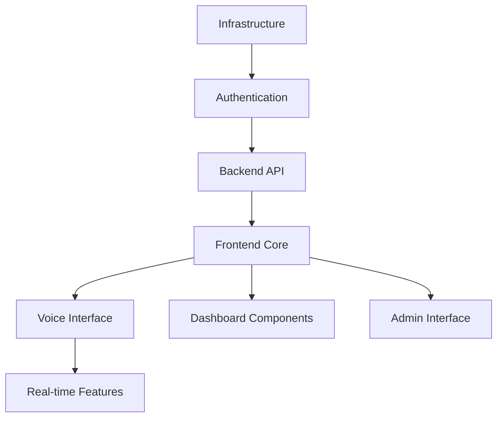
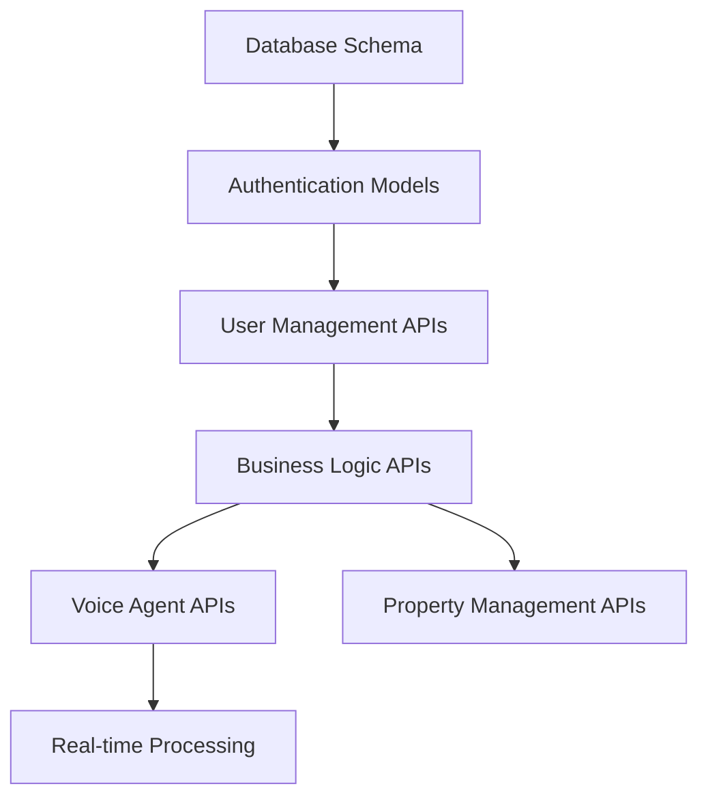
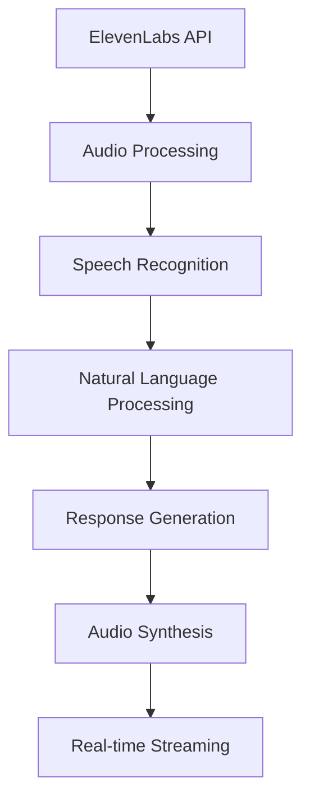

# Component Dependency Matrix

*Last Updated: 2025-08-09*

## Overview
This matrix maps critical dependencies between Seiketsu AI components to coordinate development efforts and identify potential bottlenecks.

## Dependency Legend
- 🔴 **Critical Dependency**: Blocking relationship
- 🟡 **Important Dependency**: Significant impact but not blocking
- 🟢 **Nice-to-have Dependency**: Enhancement relationship
- ⚪ **No Dependency**: Independent components

## Primary Component Matrix

| Component | Frontend | Backend API | Voice AI | Infrastructure | Database | Authentication |
|-----------|----------|-------------|----------|----------------|----------|----------------|
| **Frontend** | - | 🔴 | 🟡 | 🔴 | ⚪ | 🔴 |
| **Backend API** | 🟡 | - | 🟡 | 🔴 | 🔴 | 🔴 |
| **Voice AI** | 🟡 | 🔴 | - | 🟡 | 🟡 | 🟡 |
| **Infrastructure** | 🔴 | 🔴 | 🟡 | - | 🔴 | 🔴 |
| **Database** | ⚪ | 🔴 | 🟡 | 🔴 | - | 🔴 |
| **Authentication** | 🔴 | 🔴 | 🟡 | 🔴 | 🔴 | - |

## Critical Path Analysis

### Tier 1 Dependencies (Must Complete First)
1. **Infrastructure Foundation**
   - AWS account setup and configuration
   - Terraform infrastructure as code
   - VPC, subnets, and security groups
   - Database provisioning (Supabase)
   
2. **Authentication System**
   - User management and sessions
   - JWT token implementation
   - Role-based access control
   - OAuth provider integration

### Tier 2 Dependencies (Core Functionality)
3. **Backend API Core**
   - FastAPI application structure
   - Database models and migrations
   - Core CRUD operations
   - API documentation (OpenAPI)
   
4. **Frontend Foundation**
   - Next.js application structure
   - Tailwind CSS configuration
   - Component library setup
   - State management (Zustand)

### Tier 3 Dependencies (Feature Integration)
5. **Voice AI Integration**
   - ElevenLabs API connection
   - Real-time audio processing
   - Conversation state management
   - Voice analytics pipeline

6. **Advanced Features**
   - Real estate data integration
   - Lead scoring algorithms
   - Calendar and scheduling
   - Reporting and analytics

## Detailed Dependency Breakdown

### Frontend Dependencies

#### Critical Blockers for Frontend
- **Infrastructure**: Cannot deploy without AWS setup
- **Authentication**: Cannot implement protected routes
- **Backend API**: Cannot fetch real data

#### Integration Points
- **API Client**: Axios/Fetch configuration with auth
- **WebSocket**: Real-time voice communication
- **State Management**: Global app state synchronization

### Backend API Dependencies

#### Critical Blockers for Backend
- **Database**: Cannot store user data or sessions
- **Authentication**: Cannot secure API endpoints
- **Infrastructure**: Cannot deploy or scale

#### Integration Points
- **Database ORM**: SQLAlchemy models and relationships
- **Authentication**: JWT middleware and decorators
- **Voice Processing**: Async audio pipeline integration

### Voice AI Dependencies

#### Critical Blockers for Voice AI
- **Backend API**: Cannot store conversation data
- **Infrastructure**: Cannot handle real-time processing load
- **Frontend**: Cannot display voice interface

#### Integration Points
- **WebRTC**: Browser audio capture and playback
- **WebSocket**: Real-time audio streaming
- **API Gateway**: Request routing and load balancing

## Risk Assessment by Dependency

### High-Risk Dependencies (Red Zone)
1. **Infrastructure → All Components**
   - **Risk**: Single point of failure for entire system
   - **Mitigation**: Priority development, dedicated DevOps resource
   - **Timeline**: Must complete in next 2 weeks

2. **Authentication → Frontend + Backend**
   - **Risk**: Security vulnerabilities, unable to launch
   - **Mitigation**: Use proven libraries, security audit
   - **Timeline**: Complete in 1 week

### Medium-Risk Dependencies (Yellow Zone)
3. **Voice AI → User Experience**
   - **Risk**: Core feature not working impacts user adoption
   - **Mitigation**: Fallback UI, progressive enhancement
   - **Timeline**: Core functionality in 3 weeks

4. **Backend API → Frontend Data**
   - **Risk**: Frontend cannot display real data
   - **Mitigation**: Mock data, incremental API completion
   - **Timeline**: Core endpoints in 2 weeks

### Low-Risk Dependencies (Green Zone)
5. **Advanced Features → Core Functionality**
   - **Risk**: Nice-to-have features may be delayed
   - **Mitigation**: Phase 2 implementation, MVP focus
   - **Timeline**: Post-launch enhancement

## Coordination Protocols

### Daily Dependency Standup
- **Time**: 9:00 AM EST
- **Duration**: 15 minutes
- **Focus**: Blocking dependencies only
- **Attendees**: Tech leads from each component team

### Weekly Dependency Review
- **Time**: Friday 2:00 PM EST
- **Duration**: 30 minutes
- **Focus**: Upcoming dependencies, risk assessment
- **Attendees**: Full engineering team

### Dependency Change Protocol
1. **Impact Assessment**: Evaluate downstream effects
2. **Stakeholder Notification**: Alert affected teams within 2 hours
3. **Timeline Adjustment**: Update project timeline if necessary
4. **Communication**: Update all relevant documentation

## Integration Testing Strategy

### Continuous Integration
- **Unit Tests**: Each component independently
- **Integration Tests**: Cross-component functionality
- **End-to-End Tests**: Full user workflow validation

### Staging Environment
- **Purpose**: Validate component integration
- **Data**: Production-like test data
- **Monitoring**: Full observability stack

### Production Deployment
- **Blue-Green**: Zero-downtime deployments
- **Feature Flags**: Gradual rollout capability
- **Rollback**: Quick reversion if integration fails

This dependency matrix is reviewed and updated weekly to ensure accurate coordination across all teams.
