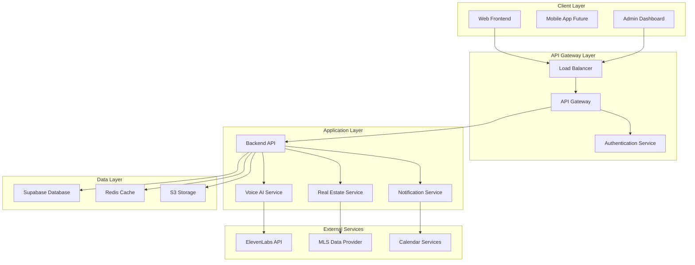

# Integration Points Documentation

*Last Updated: 2025-08-09*

## Overview
This document defines all critical integration points within the Seiketsu AI platform to ensure seamless component communication and data flow.

## System Architecture Integration Map



## Critical Integration Points

### 1. Frontend ↔ Backend API Integration

#### Authentication Flow
```typescript
// Frontend Authentication Integration
interface AuthResponse {
  accessToken: string;
  refreshToken: string;
  user: UserProfile;
}

// API Client Configuration
const apiClient = axios.create({
  baseURL: process.env.NEXT_PUBLIC_API_URL,
  timeout: 10000,
  headers: {
    'Content-Type': 'application/json',
  },
});

// Token Refresh Interceptor
apiClient.interceptors.response.use(
  (response) => response,
  async (error) => {
    if (error.response?.status === 401) {
      await refreshToken();
      return apiClient.request(error.config);
    }
    return Promise.reject(error);
  }
);
```

#### Data Synchronization
- **Real-time Updates**: WebSocket connection for live data
- **Offline Support**: Local storage with sync on reconnect
- **Caching Strategy**: React Query for server state management
- **Error Handling**: Retry logic with exponential backoff

#### Key Endpoints
| Endpoint | Method | Purpose | Authentication |
|----------|--------|---------|----------------|
| `/api/v1/auth/login` | POST | User authentication | Public |
| `/api/v1/users/profile` | GET | User profile data | Required |
| `/api/v1/conversations` | GET/POST | Voice conversations | Required |
| `/api/v1/properties` | GET | Property listings | Required |
| `/api/v1/agents/{id}/performance` | GET | Agent metrics | Admin Only |

### 2. Backend API ↔ Voice AI Integration

#### Real-time Voice Processing Pipeline
```python
# Voice Processing Integration
from typing import AsyncGenerator
import asyncio
from elevenlabs import ElevenLabs

class VoiceProcessor:
    def __init__(self):
        self.elevenlabs = ElevenLabs(api_key=settings.ELEVENLABS_API_KEY)
        self.redis = Redis(url=settings.REDIS_URL)
    
    async def process_conversation(
        self, 
        user_audio: bytes,
        session_id: str
    ) -> AsyncGenerator[bytes, None]:
        # Speech-to-text processing
        transcript = await self.speech_to_text(user_audio)
        
        # Conversation context retrieval
        context = await self.get_conversation_context(session_id)
        
        # AI response generation
        response = await self.generate_response(transcript, context)
        
        # Text-to-speech synthesis
        audio_stream = self.elevenlabs.generate_stream(
            text=response,
            voice="Sarah",
            model="eleven_turbo_v2"
        )
        
        async for audio_chunk in audio_stream:
            yield audio_chunk
```

#### WebSocket Integration
- **Connection Management**: Persistent WebSocket connections
- **Audio Streaming**: Real-time bidirectional audio flow
- **Session Handling**: Conversation state management
- **Error Recovery**: Automatic reconnection and resume

### 3. Database Integration Layer

#### Supabase Configuration
```python
# Database Models Integration
from sqlalchemy import create_engine
from sqlalchemy.ext.declarative import declarative_base
from sqlalchemy.orm import sessionmaker

class DatabaseManager:
    def __init__(self):
        self.engine = create_engine(
            settings.SUPABASE_CONNECTION_STRING,
            pool_size=20,
            max_overflow=30,
            pool_pre_ping=True,
            pool_recycle=300
        )
        self.SessionLocal = sessionmaker(
            autocommit=False,
            autoflush=False,
            bind=self.engine
        )
    
    async def get_session(self):
        async with self.SessionLocal() as session:
            try:
                yield session
                await session.commit()
            except Exception:
                await session.rollback()
                raise
            finally:
                await session.close()
```

#### Data Models Relationships
```sql
-- Core Entity Relationships
CREATE TABLE organizations (
    id UUID PRIMARY KEY DEFAULT gen_random_uuid(),
    name VARCHAR(255) NOT NULL,
    created_at TIMESTAMP DEFAULT NOW()
);

CREATE TABLE users (
    id UUID PRIMARY KEY DEFAULT gen_random_uuid(),
    email VARCHAR(255) UNIQUE NOT NULL,
    organization_id UUID REFERENCES organizations(id),
    role user_role DEFAULT 'agent',
    created_at TIMESTAMP DEFAULT NOW()
);

CREATE TABLE conversations (
    id UUID PRIMARY KEY DEFAULT gen_random_uuid(),
    user_id UUID REFERENCES users(id),
    client_phone VARCHAR(20),
    transcript JSONB,
    status conversation_status DEFAULT 'active',
    created_at TIMESTAMP DEFAULT NOW()
);

CREATE TABLE properties (
    id UUID PRIMARY KEY DEFAULT gen_random_uuid(),
    organization_id UUID REFERENCES organizations(id),
    mls_id VARCHAR(50),
    address TEXT NOT NULL,
    property_data JSONB,
    created_at TIMESTAMP DEFAULT NOW()
);
```

### 4. External Service Integration

#### ElevenLabs Voice API
```typescript
// Frontend Voice Interface Integration
class VoiceInterface {
  private socket: WebSocket;
  private audioContext: AudioContext;
  private mediaRecorder: MediaRecorder;
  
  async initializeVoiceChat(sessionId: string) {
    // WebSocket connection to backend
    this.socket = new WebSocket(
      `${process.env.NEXT_PUBLIC_WS_URL}/voice/${sessionId}`
    );
    
    // Audio context setup
    this.audioContext = new AudioContext();
    
    // Media recorder for user input
    const stream = await navigator.mediaDevices.getUserMedia({
      audio: {
        echoCancellation: true,
        noiseSuppression: true,
        autoGainControl: true,
        sampleRate: 44100
      }
    });
    
    this.mediaRecorder = new MediaRecorder(stream, {
      mimeType: 'audio/webm;codecs=opus'
    });
    
    // Handle audio data
    this.mediaRecorder.ondataavailable = (event) => {
      if (event.data.size > 0) {
        this.socket.send(event.data);
      }
    };
    
    // Handle AI response audio
    this.socket.onmessage = (event) => {
      this.playAudioResponse(event.data);
    };
  }
  
  private async playAudioResponse(audioData: Blob) {
    const audioBuffer = await audioData.arrayBuffer();
    const decodedAudio = await this.audioContext.decodeAudioData(audioBuffer);
    
    const source = this.audioContext.createBufferSource();
    source.buffer = decodedAudio;
    source.connect(this.audioContext.destination);
    source.start();
  }
}
```

#### MLS Data Integration
```python
# Property Data Synchronization
class MLSIntegration:
    def __init__(self):
        self.mls_client = MLSClient(
            api_key=settings.MLS_API_KEY,
            base_url=settings.MLS_BASE_URL
        )
    
    async def sync_properties(self, organization_id: str):
        """Synchronize property data from MLS"""
        try:
            # Fetch updates since last sync
            last_sync = await self.get_last_sync_time(organization_id)
            properties = await self.mls_client.get_properties(
                modified_since=last_sync,
                organization_id=organization_id
            )
            
            # Process and store property data
            for property_data in properties:
                await self.process_property(property_data, organization_id)
            
            # Update sync timestamp
            await self.update_sync_time(organization_id)
            
        except Exception as e:
            logger.error(f"MLS sync failed for org {organization_id}: {e}")
            raise
```

## Integration Testing Strategy

### Automated Integration Tests
```python
# pytest integration tests
@pytest.mark.asyncio
async def test_voice_conversation_flow():
    """Test complete voice conversation integration"""
    # Setup test data
    user = await create_test_user()
    session_id = str(uuid.uuid4())
    
    # Test WebSocket connection
    async with websockets.connect(f"ws://localhost:8000/voice/{session_id}") as ws:
        # Send test audio data
        test_audio = load_test_audio("hello_test.wav")
        await ws.send(test_audio)
        
        # Receive and validate AI response
        response = await ws.recv()
        assert isinstance(response, bytes)
        assert len(response) > 0
        
    # Validate conversation was stored
    conversation = await get_conversation_by_session(session_id)
    assert conversation is not None
    assert len(conversation.transcript) > 0
```

### Performance Benchmarks
- **API Response Time**: <200ms for standard requests
- **Voice Processing Latency**: <500ms end-to-end
- **Database Query Time**: <50ms for typical queries
- **Frontend Load Time**: <2 seconds initial load

### Error Handling Protocols

#### Circuit Breaker Pattern
```python
from circuit_breaker import CircuitBreaker

@CircuitBreaker(failure_threshold=5, recovery_timeout=30)
async def call_external_service(request_data):
    """Protected external service call"""
    try:
        return await external_service.call(request_data)
    except Exception as e:
        logger.error(f"External service call failed: {e}")
        raise
```

#### Graceful Degradation
- **Voice Service Down**: Fall back to text-based interaction
- **Database Unavailable**: Use cached data with user notification
- **MLS Service Down**: Display last known property data
- **Authentication Service Down**: Allow read-only access

## Monitoring Integration

### Health Check Endpoints
```python
# Health monitoring integration
@app.get("/health")
async def health_check():
    checks = {
        "database": await check_database_connection(),
        "redis": await check_redis_connection(),
        "elevenlabs": await check_elevenlabs_api(),
        "mls": await check_mls_connection()
    }
    
    all_healthy = all(checks.values())
    status_code = 200 if all_healthy else 503
    
    return JSONResponse(
        content={"status": "healthy" if all_healthy else "unhealthy", "checks": checks},
        status_code=status_code
    )
```

### Observability Stack
- **Logging**: Structured logging with correlation IDs
- **Metrics**: Prometheus metrics for all integration points
- **Tracing**: Distributed tracing with OpenTelemetry
- **Alerting**: PagerDuty integration for critical failures

This integration documentation is maintained by the platform architecture team and updated with each sprint.
