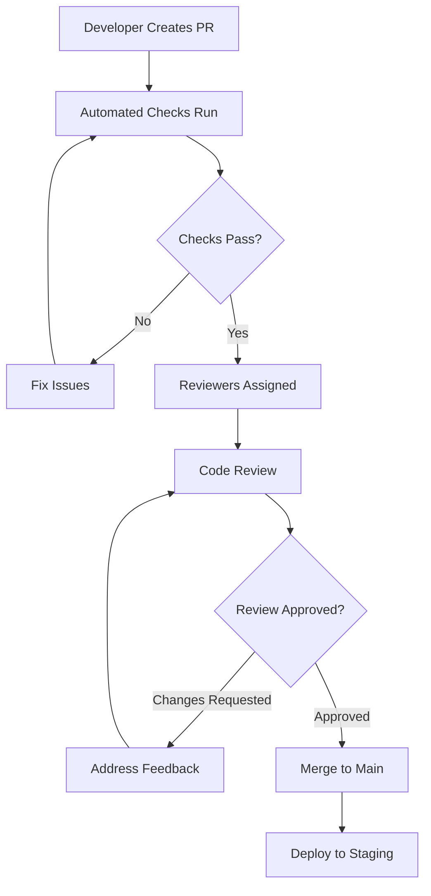

# Code Review Process

*Last Updated: 2025-08-09*

## Overview
The code review process ensures code quality, knowledge sharing, and maintainability across the Seiketsu AI platform while maintaining development velocity.

## Code Review Philosophy

### Core Principles
1. **Quality Over Speed**: Better to review thoroughly than quickly
2. **Learning Opportunity**: Both reviewer and author should learn
3. **Collective Ownership**: Everyone is responsible for code quality
4. **Constructive Feedback**: Focus on improvement, not criticism
5. **Security First**: Always consider security implications

### Review Objectives
- Catch bugs before they reach production
- Ensure code follows established standards
- Share knowledge across the team
- Maintain system architecture integrity
- Verify security and performance considerations

## Review Process Workflow



## Pull Request Standards

### PR Title Convention
```
type(scope): brief description

# Examples:
feat(auth): implement JWT authentication system
fix(voice): resolve audio latency issues
docs(api): update endpoint documentation
refactor(dashboard): optimize performance queries
```

### PR Description Template
```markdown
## Summary
Brief description of what this PR accomplishes.

## Changes Made
- [ ] Specific change 1
- [ ] Specific change 2
- [ ] Specific change 3

## Testing
- [ ] Unit tests added/updated
- [ ] Integration tests passing
- [ ] Manual testing completed
- [ ] Performance impact assessed

## Screenshots/Videos
[If UI changes, include before/after screenshots]

## Migration Notes
[Database migrations, configuration changes, etc.]

## Security Considerations
[Any security implications or reviews needed]

## Performance Impact
[Performance testing results or analysis]

## Related Issues
Closes #123
Related to #456

## Checklist
- [ ] Code follows style guidelines
- [ ] Self-review completed
- [ ] Documentation updated
- [ ] Tests added for new functionality
- [ ] No breaking changes (or properly documented)
```

### PR Size Guidelines
- **Small PR**: <200 lines changed (preferred)
- **Medium PR**: 200-500 lines changed (acceptable with good description)
- **Large PR**: >500 lines changed (requires justification and extra scrutiny)

## Automated Pre-Review Checks

### GitHub Actions Workflow
```yaml
name: PR Validation

on:
  pull_request:
    branches: [main, develop]

jobs:
  validate:
    runs-on: ubuntu-latest
    steps:
      - name: Checkout code
        uses: actions/checkout@v3
      
      - name: Setup Node.js
        uses: actions/setup-node@v3
        with:
          node-version: '18'
          cache: 'npm'
      
      - name: Install dependencies
        run: npm ci
      
      - name: Lint code
        run: npm run lint
      
      - name: Type check
        run: npm run type-check
      
      - name: Run tests
        run: npm run test:ci
      
      - name: Build application
        run: npm run build
      
      - name: Security audit
        run: npm audit --audit-level high
      
      - name: Bundle size check
        run: npm run bundle-analyzer
```

### Quality Gates
1. **Linting**: ESLint rules must pass
2. **Type Checking**: TypeScript compilation must succeed
3. **Tests**: All tests must pass with >80% coverage
4. **Build**: Application must build successfully
5. **Security**: No high/critical vulnerabilities
6. **Performance**: Bundle size within limits

## Review Assignment Strategy

### CODEOWNERS Configuration
```
# Global ownership
* @seiketsu-ai/senior-engineers

# Frontend specific
/apps/web/ @seiketsu-ai/frontend-team
/apps/web/components/ @seiketsu-ai/frontend-leads

# Backend specific
/apps/api/ @seiketsu-ai/backend-team
/apps/api/app/core/ @seiketsu-ai/backend-leads

# Infrastructure
/infrastructure/ @seiketsu-ai/devops-team
/docker/ @seiketsu-ai/devops-team
/.github/workflows/ @seiketsu-ai/devops-team

# Documentation
/docs/ @seiketsu-ai/tech-writers
/README.md @seiketsu-ai/tech-writers

# Security sensitive
/apps/api/app/core/auth.py @seiketsu-ai/security-team
/apps/api/app/core/middleware.py @seiketsu-ai/security-team
```

### Reviewer Assignment Rules
1. **Automatic Assignment**: GitHub assigns based on CODEOWNERS
2. **Manual Assignment**: Author can request specific reviewers
3. **Load Balancing**: Rotate reviews to prevent bottlenecks
4. **Expertise Matching**: Assign domain experts for complex changes
5. **Cross-Team Reviews**: Include other teams for integration changes

### Review Capacity Management
```typescript
interface ReviewerCapacity {
  reviewer: string;
  currentReviews: number;
  maxCapacity: number;
  expertise: string[];
  availability: 'available' | 'busy' | 'out-of-office';
}

// Example capacity tracking
const reviewCapacity: ReviewerCapacity[] = [
  {
    reviewer: 'alice-smith',
    currentReviews: 2,
    maxCapacity: 3,
    expertise: ['frontend', 'ui-ux', 'accessibility'],
    availability: 'available'
  },
  {
    reviewer: 'bob-johnson', 
    currentReviews: 1,
    maxCapacity: 4,
    expertise: ['backend', 'database', 'api-design'],
    availability: 'available'
  }
];
```

## Review Checklist and Guidelines

### Comprehensive Review Checklist

#### Functionality Review
```markdown
- [ ] Code implements requirements correctly
- [ ] Edge cases are handled appropriately
- [ ] Error handling is comprehensive and user-friendly
- [ ] Input validation is thorough
- [ ] Business logic is correct and efficient
- [ ] API contracts are maintained
```

#### Code Quality Review
```markdown
- [ ] Code is readable and well-structured
- [ ] Functions are focused and single-purpose
- [ ] Variable and function names are descriptive
- [ ] Comments explain 'why' not 'what'
- [ ] No code duplication (DRY principle)
- [ ] Proper abstractions and design patterns used
- [ ] Code follows established style guide
```

#### Security Review
```markdown
- [ ] Input is validated and sanitized
- [ ] Authentication/authorization is correct
- [ ] No sensitive information exposed
- [ ] SQL injection prevention measures
- [ ] XSS prevention implemented
- [ ] CSRF protection in place
- [ ] Rate limiting considered
- [ ] Secrets managed properly
```

#### Performance Review
```markdown
- [ ] Algorithms are efficient
- [ ] Database queries are optimized
- [ ] Caching strategies implemented where appropriate
- [ ] Memory usage is reasonable
- [ ] Network requests are minimized
- [ ] Bundle size impact acceptable
- [ ] Loading performance considered
```

#### Testing Review
```markdown
- [ ] Unit tests cover happy path scenarios
- [ ] Unit tests cover error conditions
- [ ] Edge cases are tested
- [ ] Integration tests for complex flows
- [ ] Tests are maintainable and readable
- [ ] Mock usage is appropriate
- [ ] Test coverage meets requirements
```

#### Architecture Review
```markdown
- [ ] Changes align with system architecture
- [ ] Dependencies are appropriate
- [ ] Interfaces are well-designed
- [ ] Separation of concerns maintained
- [ ] SOLID principles followed
- [ ] Future extensibility considered
```

### Review Comments Guidelines

#### Effective Comment Examples

**Good Comments:**
```markdown
# Constructive and Specific
"Consider using a Map instead of an object here for better performance with frequent lookups. Maps have O(1) average case for get/set operations."

# Educational
"This could be vulnerable to XSS attacks. Consider using DOMPurify to sanitize HTML content before rendering."

# Architectural Guidance
"This logic might be better placed in a service layer to maintain separation of concerns. Would you consider moving it to UserService?"
```

**Comments to Avoid:**
```markdown
# Too Vague
"This doesn't look right."

# Overly Critical
"This is terrible code."

# Nitpicky
"Missing semicolon on line 42."
```

#### Comment Classification
- **🚨 Blocking**: Must be fixed before merge
- **💡 Suggestion**: Consider for improvement
- **❓ Question**: Seeking clarification
- **📖 Educational**: Sharing knowledge
- **👍 Praise**: Recognizing good work

## Review Response and Resolution

### Author Response Guidelines
1. **Acknowledge All Feedback**: Respond to every comment
2. **Ask for Clarification**: If feedback is unclear
3. **Explain Decisions**: When choosing not to implement suggestion
4. **Be Grateful**: Appreciate the reviewer's time and effort
5. **Update Efficiently**: Address feedback in batches

### Feedback Resolution Process
```markdown
## Resolution Workflow
1. Author reads all feedback
2. Author asks clarifying questions if needed
3. Author implements changes or explains why not
4. Author marks conversations as resolved
5. Reviewer validates resolution
6. Review cycle continues until approval
```

### Disagreement Resolution
1. **Discussion First**: Try to reach consensus through discussion
2. **Involve Tech Lead**: Escalate to technical lead if needed
3. **Architecture Review**: Bring to architecture review for complex issues
4. **Document Decision**: Record the final decision and rationale

## Review Performance Metrics

### Key Performance Indicators
```typescript
interface ReviewMetrics {
  averageReviewTime: number; // hours
  reviewThroughput: number;   // reviews per day
  defectEscapeRate: number;   // bugs found in production
  reviewCoverage: number;     // % of lines reviewed
  participationRate: number;  // % of team participating
}

// Target metrics
const targetMetrics: ReviewMetrics = {
  averageReviewTime: 24,    // 24 hours max
  reviewThroughput: 5,      // 5 reviews per day per reviewer
  defectEscapeRate: 0.05,   // <5% bugs escape to production
  reviewCoverage: 0.95,     // 95% of code reviewed
  participationRate: 1.0    // 100% team participation
};
```

### Monitoring Dashboard
```sql
-- Review metrics queries
SELECT 
  DATE_TRUNC('week', created_at) as week,
  AVG(EXTRACT(EPOCH FROM (merged_at - created_at))/3600) as avg_review_hours,
  COUNT(*) as total_prs,
  AVG(lines_added + lines_deleted) as avg_pr_size
FROM pull_requests 
WHERE merged_at IS NOT NULL
  AND created_at >= NOW() - INTERVAL '3 months'
GROUP BY week
ORDER BY week;
```

## Review Culture and Best Practices

### Building Positive Review Culture
1. **Celebrate Learning**: Acknowledge when reviews lead to learning
2. **Share Knowledge**: Use reviews as teaching opportunities
3. **Recognize Contributions**: Praise good reviews and implementations
4. **Continuous Improvement**: Regularly retrospect on review process
5. **Balance Rigor with Velocity**: Don't let perfect be enemy of good

### Review Meeting Cadence
- **Daily Standup**: Mention blocking review needs
- **Weekly Review Sync**: Discuss review process improvements
- **Monthly Metrics Review**: Analyze review performance data
- **Quarterly Process Review**: Major process improvements

### Code Review Tools and Integration

#### GitHub Integration
```yaml
# .github/pr-review-template.md
---
name: Code Review
about: Template for code reviews
---

## Review Checklist
- [ ] Functionality works as expected
- [ ] Code quality meets standards
- [ ] Security considerations addressed
- [ ] Performance impact acceptable
- [ ] Tests provide adequate coverage
- [ ] Documentation updated

## Additional Notes
[Any additional context or concerns]
```

#### Review Automation
```javascript
// GitHub Actions for review automation
const reviewAutomation = {
  assignReviewers: 'auto-assign based on CODEOWNERS',
  checklistValidation: 'ensure PR template completed',
  sizeAnalysis: 'warn on large PRs',
  securityScanning: 'automated security review',
  performanceTesting: 'automated performance impact analysis'
};
```

## Emergency and Hotfix Review Process

### Expedited Review Protocol
```markdown
## Hotfix Review Process
1. Label PR with 'hotfix' or 'emergency'
2. Notify on-call reviewer immediately
3. Abbreviated checklist focusing on:
   - Security implications
   - Breaking changes
   - Rollback capability
4. Fast-track approval (2-hour SLA)
5. Monitor deployment closely
6. Full retrospective post-incident
```

### Post-Deployment Review
- All hotfixes get full review post-deployment
- Identify process improvements
- Update documentation based on learnings
- Share incident learnings with team

## Training and Onboarding

### New Team Member Review Training
1. **Shadow Reviews**: Observe senior reviewers for first week
2. **Guided Reviews**: Senior reviewer guides through first 5 reviews
3. **Practice Reviews**: Review training PRs with known issues
4. **Feedback Session**: One-on-one review of review quality
5. **Independence**: Full review privileges after demonstrated competency

### Continuous Education
- Monthly "Review of the Month" highlighting exceptional reviews
- Quarterly training on new tools and techniques
- Conference talks and blog posts on review best practices
- Internal lunch-and-learns on domain-specific review topics

This code review process ensures high-quality code delivery while maintaining team velocity and fostering a collaborative development culture.
