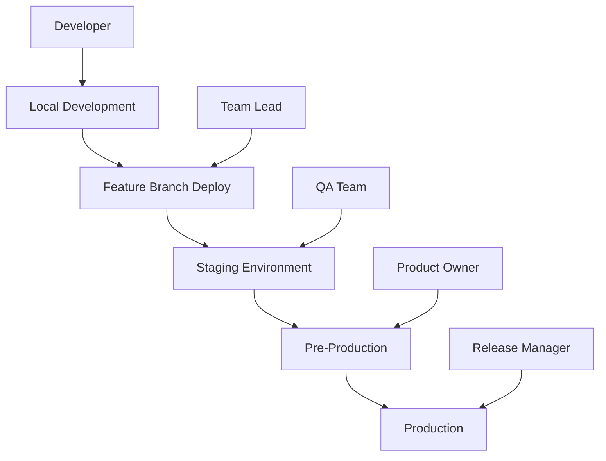
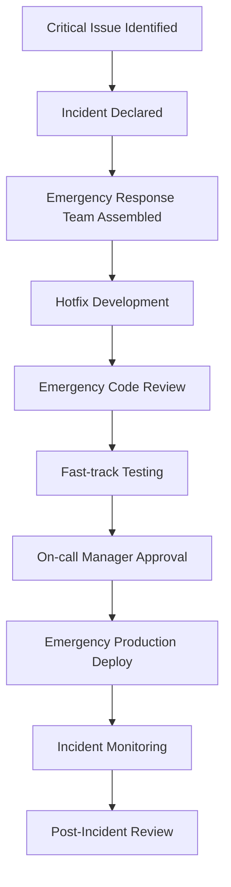

# Deployment Approval Chain

*Last Updated: 2025-08-09*

## Overview
This document defines the deployment approval chain for Seiketsu AI to ensure safe, coordinated, and auditable deployments across all environments while maintaining development velocity.

## Deployment Environments



### Environment Specifications
| Environment | Purpose | Approver | Auto-Deploy | Data |
|-------------|---------|----------|-------------|------|
| **Local** | Development | Developer | N/A | Mock/Test Data |
| **Feature** | Branch Testing | Team Lead | Yes | Staging Data |
| **Staging** | Integration Testing | QA Lead | Yes | Production-like |
| **Pre-Prod** | Final Validation | Product Owner | Manual | Production Subset |
| **Production** | Live System | Release Manager | Manual | Live Data |

## Approval Authority Matrix

### Standard Deployments
| Component | Staging | Pre-Production | Production |
|-----------|---------|---------------|------------|
| **Frontend** | QA Lead | Product Owner | Release Manager |
| **Backend API** | QA Lead + Tech Lead | Product Owner + CTO | Release Manager + CTO |
| **Database** | Tech Lead | CTO | CTO + Security Lead |
| **Infrastructure** | DevOps Lead | CTO | CTO + Security Lead |
| **Voice AI** | QA Lead + AI Lead | Product Owner + CTO | Release Manager + CTO |

### Emergency Deployments (Hotfixes)
| Severity | Approver | Timeline | Additional Requirements |
|----------|----------|----------|------------------------|
| **Critical** | On-call Engineer | Immediate | Post-deployment review |
| **High** | Tech Lead | <2 hours | Security review |
| **Medium** | Release Manager | <4 hours | Standard process |

## Deployment Workflow

### Standard Deployment Process

#### Phase 1: Development Complete
```markdown
## Prerequisites
- [ ] All acceptance criteria met
- [ ] Code review completed and approved
- [ ] All tests passing (unit, integration, e2e)
- [ ] Security scan completed with no critical issues
- [ ] Performance benchmarks met
- [ ] Documentation updated
```

#### Phase 2: Staging Deployment
**Automatic Trigger**: Merge to main branch
**Approval Required**: None (automatic)
**Validation Steps**:
1. Automated deployment to staging
2. Health checks and smoke tests
3. Notification to QA team
4. Integration test suite execution

**QA Validation Checklist**:
```markdown
- [ ] Core user workflows functioning
- [ ] API endpoints responding correctly
- [ ] Voice interface working properly
- [ ] Database migrations successful
- [ ] Performance metrics within acceptable ranges
- [ ] Security headers and configurations correct
```

**Approval Criteria**:
- All automated tests pass
- QA manual validation complete
- No critical bugs identified

#### Phase 3: Pre-Production Deployment
**Trigger**: QA approval + release candidate tag
**Approval Required**: Product Owner
**Timeline**: Complete within 24 hours of staging approval

**Pre-Production Checklist**:
```markdown
## Technical Validation
- [ ] Load testing completed successfully
- [ ] Security penetration testing passed
- [ ] Backup and recovery procedures tested
- [ ] Monitoring and alerting configured
- [ ] Feature flags configured correctly

## Business Validation
- [ ] User acceptance testing completed
- [ ] Stakeholder demo completed
- [ ] Customer communication prepared
- [ ] Support documentation updated
- [ ] Training materials prepared

## Compliance Validation
- [ ] Privacy impact assessment completed
- [ ] Data governance review passed
- [ ] Audit trail documentation complete
- [ ] Regulatory compliance verified
```

**Product Owner Approval Process**:
1. Review feature functionality against requirements
2. Validate user experience meets standards
3. Confirm business metrics and success criteria
4. Approve marketing and communication materials
5. Sign-off on release notes

#### Phase 4: Production Deployment
**Trigger**: Pre-production approval + release schedule
**Approval Required**: Release Manager + additional approvers based on component
**Timeline**: Scheduled deployment windows

**Production Readiness Checklist**:
```markdown
## Infrastructure Readiness
- [ ] Production environment health verified
- [ ] Database backup completed
- [ ] CDN and caching configured
- [ ] SSL certificates valid and up-to-date
- [ ] DNS configurations verified
- [ ] Load balancer health checks configured

## Operational Readiness
- [ ] On-call team notified and available
- [ ] Rollback plan prepared and tested
- [ ] Communication plan executed
- [ ] Customer support team briefed
- [ ] Monitoring dashboards prepared
- [ ] Incident response team on standby

## Release Management
- [ ] Release notes published
- [ ] Feature flag rollout plan confirmed
- [ ] Gradual rollout schedule defined
- [ ] Success metrics baseline established
- [ ] Post-deployment validation plan ready
```

## Approval Workflows by Component Type

### Frontend Application Deployment
```yaml
# Frontend deployment approval workflow
frontend_deployment:
  staging:
    automatic: true
    approvers: []
    validations:
      - build_success
      - unit_tests
      - e2e_tests
      - lighthouse_scores
  
  pre_production:
    automatic: false
    approvers: ['product_owner']
    validations:
      - ux_review
      - accessibility_audit
      - performance_benchmark
      - browser_compatibility
  
  production:
    automatic: false
    approvers: ['release_manager']
    validations:
      - final_stakeholder_approval
      - cdn_configuration
      - feature_flag_setup
      - monitoring_alerts
```

### Backend API Deployment
```yaml
# Backend deployment approval workflow
backend_deployment:
  staging:
    automatic: true
    approvers: []
    validations:
      - unit_tests
      - integration_tests
      - api_contract_tests
      - database_migrations
  
  pre_production:
    automatic: false
    approvers: ['tech_lead', 'product_owner']
    validations:
      - load_testing
      - security_scan
      - data_validation
      - api_documentation
  
  production:
    automatic: false
    approvers: ['release_manager', 'cto']
    validations:
      - security_review
      - performance_benchmarks
      - backup_verification
      - disaster_recovery_test
```

### Database Migration Deployment
```yaml
# Database deployment approval workflow
database_deployment:
  staging:
    automatic: true
    approvers: []
    validations:
      - migration_tests
      - data_integrity_checks
      - rollback_test
  
  pre_production:
    automatic: false
    approvers: ['tech_lead', 'dba']
    validations:
      - performance_impact_analysis
      - index_optimization
      - query_performance_test
      - backup_strategy_verification
  
  production:
    automatic: false
    approvers: ['cto', 'security_lead']
    validations:
      - change_advisory_board_approval
      - maintenance_window_scheduled
      - communication_sent
      - expert_standby_confirmed
```

## Emergency Deployment Process

### Critical Hotfix Workflow


### Emergency Approval Authority
```markdown
## On-Call Emergency Powers
**Who**: Designated on-call engineer
**When**: Critical production issues (P0/P1)
**Scope**: Can deploy fixes without standard approvals
**Limitations**: 
- Must be genuine emergency
- Limited to minimal fix scope
- Requires immediate post-deployment review
- Must notify leadership within 30 minutes

## Emergency Contact Chain
1. On-call Engineer (immediate)
2. Tech Lead (within 15 minutes)
3. Engineering Manager (within 30 minutes)
4. CTO (within 1 hour)
5. CEO (for customer-impacting issues)
```

### Post-Emergency Review Process
All emergency deployments require:
1. **Immediate Review** (within 24 hours)
2. **Root Cause Analysis** (within 48 hours)
3. **Process Improvement Plan** (within 1 week)
4. **Team Learning Session** (within 2 weeks)

## Deployment Automation and Tools

### GitHub Actions Approval Workflow
```yaml
name: Production Deployment

on:
  push:
    tags:
      - 'v*'

jobs:
  pre_deployment_checks:
    runs-on: ubuntu-latest
    steps:
      - name: Validate release tag
        run: |
          echo "Validating release tag format"
          [[ ${{ github.ref_name }} =~ ^v[0-9]+\.[0-9]+\.[0-9]+$ ]]
      
      - name: Check release notes
        run: |
          echo "Validating release notes exist"
          test -f "RELEASE_NOTES.md"
  
  security_scan:
    needs: pre_deployment_checks
    runs-on: ubuntu-latest
    steps:
      - name: Security audit
        run: npm audit --audit-level high
      
      - name: Dependency check
        run: npm run security:check
  
  approval_gate:
    needs: [pre_deployment_checks, security_scan]
    runs-on: ubuntu-latest
    environment: production
    steps:
      - name: Wait for approval
        run: |
          echo "Waiting for release manager approval..."
          echo "Deployment will proceed after manual approval."
  
  production_deploy:
    needs: approval_gate
    runs-on: ubuntu-latest
    steps:
      - name: Deploy to production
        run: |
          echo "Deploying to production environment..."
          ./scripts/deploy-production.sh
      
      - name: Post-deployment verification
        run: |
          echo "Running post-deployment health checks..."
          ./scripts/health-check.sh
```

### Deployment Approval Dashboard
```typescript
// Approval tracking system
interface DeploymentApproval {
  deploymentId: string;
  environment: 'staging' | 'pre-production' | 'production';
  component: string;
  version: string;
  requestedBy: string;
  approvers: ApprovalStatus[];
  status: 'pending' | 'approved' | 'rejected' | 'deployed';
  createdAt: Date;
  approvedAt?: Date;
  deployedAt?: Date;
}

interface ApprovalStatus {
  approver: string;
  role: string;
  status: 'pending' | 'approved' | 'rejected';
  comments?: string;
  approvedAt?: Date;
}

// Example approval tracking
const deploymentApprovals: DeploymentApproval[] = [
  {
    deploymentId: 'deploy-2025-001',
    environment: 'production',
    component: 'frontend',
    version: 'v1.2.3',
    requestedBy: 'alice.dev@seiketsu.ai',
    status: 'pending',
    approvers: [
      {
        approver: 'bob.release@seiketsu.ai',
        role: 'Release Manager',
        status: 'pending'
      }
    ],
    createdAt: new Date('2025-08-09T10:00:00Z')
  }
];
```

## Deployment Windows and Scheduling

### Standard Deployment Schedule
```markdown
## Regular Deployment Windows
- **Monday-Thursday**: 10:00 AM - 4:00 PM EST (normal deployments)
- **Friday**: 10:00 AM - 12:00 PM EST (critical fixes only)
- **Weekend**: Emergency deployments only

## Blackout Periods
- Major holidays
- Black Friday / Cyber Monday
- End of quarter (last 3 business days)
- During major marketing campaigns
- System maintenance windows
```

### Deployment Coordination Calendar
```ics
BEGIN:VEVENT
SUMMARY:Production Deployment Window - Frontend v1.2.3
DTSTART:20250810T150000Z
DTEND:20250810T160000Z
DESCRIPTION:Scheduled production deployment requiring Release Manager approval
ATTENDEE:release-manager@seiketsu.ai
ATTENDEE:on-call-engineer@seiketsu.ai
ATTENDEE:product-owner@seiketsu.ai
END:VEVENT
```

## Rollback Procedures

### Automated Rollback Triggers
```yaml
# Automated rollback configuration
rollback_triggers:
  health_check_failure:
    threshold: 3_consecutive_failures
    action: automatic_rollback
    notification: immediate
  
  error_rate_spike:
    threshold: 5_percent_increase
    window: 5_minutes
    action: automatic_rollback
    notification: immediate
  
  performance_degradation:
    threshold: 50_percent_slower
    window: 10_minutes
    action: automatic_rollback
    notification: immediate
```

### Manual Rollback Authority
```markdown
## Rollback Decision Authority
- **Immediate Rollback**: On-call engineer (no approval needed)
- **Planned Rollback**: Release manager approval
- **Database Rollback**: CTO approval required
- **Infrastructure Rollback**: DevOps lead + CTO approval
```

## Metrics and Reporting

### Deployment Success Metrics
```sql
-- Deployment metrics dashboard query
SELECT 
  DATE_TRUNC('week', deployed_at) as deployment_week,
  environment,
  COUNT(*) as total_deployments,
  COUNT(CASE WHEN status = 'success' THEN 1 END) as successful_deployments,
  COUNT(CASE WHEN rollback_required THEN 1 END) as rollbacks_required,
  AVG(EXTRACT(EPOCH FROM (deployed_at - requested_at))/3600) as avg_approval_time_hours
FROM deployments
WHERE deployed_at >= NOW() - INTERVAL '3 months'
GROUP BY deployment_week, environment
ORDER BY deployment_week DESC;
```

### Key Performance Indicators
- **Deployment Success Rate**: Target >99%
- **Average Approval Time**: Target <4 hours
- **Rollback Rate**: Target <2%
- **Emergency Deployment %**: Target <5%
- **Deployment Frequency**: Target 2-3x per week

## Compliance and Audit Trail

### Audit Documentation Requirements
```markdown
## Required Documentation for Each Production Deployment
- [ ] Change request with business justification
- [ ] Technical review and approval records
- [ ] Security and compliance review results
- [ ] Testing evidence and sign-off
- [ ] Deployment plan and runbook
- [ ] Rollback plan and testing evidence
- [ ] Post-deployment verification results
- [ ] Any issues or incidents during deployment
```

### Regulatory Compliance
- **SOC 2**: All deployments logged with approver identity
- **ISO 27001**: Change management process documented
- **GDPR**: Privacy impact assessments for data changes
- **Industry Standards**: Real estate compliance requirements met

This deployment approval chain ensures safe, coordinated production releases while maintaining the velocity needed for competitive advantage in the real estate AI market.
