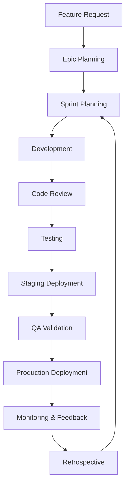
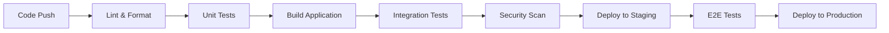

# Development Workflow Guide

*Last Updated: 2025-08-09*

## Overview
This guide defines the standardized development workflow for Seiketsu AI to ensure consistent, high-quality code delivery across all teams while maintaining rapid development velocity.

## Development Lifecycle Overview



## 6-Week Sprint Cycle Structure

### Week 0: Sprint Preparation
**Focus**: Planning and resource allocation

**Activities**:
- Epic breakdown and story estimation
- Dependency mapping and risk assessment
- Resource allocation and capacity planning
- Technical architecture review
- Stakeholder alignment and approval

**Deliverables**:
- Sprint backlog with estimated stories
- Technical design documents
- Risk mitigation plans
- Resource allocation matrix

**Success Criteria**:
- 100% of stories estimated and assigned
- All dependencies identified and planned
- Technical approach approved by architecture team
- Team capacity confirmed and committed

### Week 1-2: Development Sprint Start
**Focus**: Core development and early integration

**Daily Rhythm**:
- **9:00 AM**: Team standup (15 minutes)
- **10:00 AM**: Focused development time
- **2:00 PM**: Integration check-ins
- **4:00 PM**: Code review sessions
- **5:00 PM**: End of day sync

**Key Activities**:
- Feature development according to acceptance criteria
- Unit test development (TDD approach)
- Continuous integration and deployment
- Early integration testing
- Documentation updates

**Quality Gates**:
- All code must pass automated tests
- Code coverage minimum 80%
- No critical security vulnerabilities
- Performance benchmarks met

### Week 3-4: Integration and Refinement
**Focus**: Component integration and user testing

**Integration Protocol**:
1. **Component Integration**: Individual features integrated into larger components
2. **System Integration**: Components integrated into full system
3. **User Acceptance Testing**: Stakeholder validation of features
4. **Performance Testing**: Load and stress testing
5. **Security Testing**: Vulnerability scanning and penetration testing

**Feedback Loop**:
- Daily integration builds
- User feedback collection
- Performance metrics monitoring
- Bug triage and resolution

### Week 5: Production Preparation
**Focus**: Deployment preparation and final validation

**Pre-Deployment Checklist**:
- [ ] All acceptance criteria verified
- [ ] Security scan completed with no critical issues
- [ ] Performance testing passed
- [ ] Documentation updated
- [ ] Rollback plan prepared
- [ ] Monitoring and alerts configured
- [ ] Stakeholder sign-off obtained

**Deployment Activities**:
- Staging environment deployment
- Production deployment preparation
- Database migration testing
- Configuration management
- Feature flag setup

### Week 6: Retrospective and Planning
**Focus**: Learning and next sprint preparation

**Retrospective Agenda**:
1. **What went well?** (Celebrations)
2. **What could be improved?** (Process optimization)
3. **What blockers did we encounter?** (Risk mitigation)
4. **Action items for next sprint** (Continuous improvement)

**Metrics Review**:
- Sprint velocity and burndown
- Code quality metrics
- Bug detection and resolution times
- Team satisfaction scores
- Customer feedback analysis

## Branch Strategy and Git Workflow

### Branch Naming Convention
```
# Feature branches
feature/JIRA-123-user-authentication
feature/JIRA-456-voice-interface-improvements

# Bug fix branches
hotfix/JIRA-789-security-vulnerability
bugfix/JIRA-321-dashboard-loading-issue

# Release branches
release/v1.2.0
release/v1.2.1-hotfix
```

### Git Workflow Process
```bash
# 1. Start new feature
git checkout main
git pull origin main
git checkout -b feature/JIRA-123-feature-name

# 2. Development workflow
git add .
git commit -m "feat: implement user authentication system

- Add JWT token handling
- Implement login/logout endpoints
- Add session management
- Update security middleware

JIRA: JIRA-123"

# 3. Push and create PR
git push origin feature/JIRA-123-feature-name
# Create pull request via GitHub UI

# 4. After approval and merge
git checkout main
git pull origin main
git branch -d feature/JIRA-123-feature-name
```

### Commit Message Standards
```
type(scope): short description

- Longer description bullet points
- Explain what and why, not how
- Reference relevant tickets

JIRA: TICKET-NUMBER
Breaking-Change: [if applicable]
```

**Types**: feat, fix, docs, style, refactor, test, chore, ci

## Code Review Process

### Review Checklist
```markdown
## Functional Review
- [ ] Code meets acceptance criteria
- [ ] Edge cases handled appropriately
- [ ] Error handling implemented
- [ ] Performance considerations addressed

## Code Quality Review
- [ ] Code follows team style guide
- [ ] Functions are single-purpose and well-named
- [ ] Complex logic is commented
- [ ] No code duplication
- [ ] Proper abstractions used

## Security Review
- [ ] Input validation implemented
- [ ] Authentication/authorization correct
- [ ] No sensitive data exposed
- [ ] SQL injection prevention
- [ ] XSS prevention measures

## Testing Review
- [ ] Unit tests cover happy path
- [ ] Unit tests cover error cases
- [ ] Integration tests for complex flows
- [ ] Test coverage meets minimum threshold
- [ ] Tests are maintainable and clear

## Documentation Review
- [ ] Public APIs documented
- [ ] README updated if needed
- [ ] Breaking changes noted
- [ ] Configuration changes documented
```

### Review Assignment Rules
1. **Automatic Assignment**: GitHub assigns reviewers based on CODEOWNERS
2. **Required Approvals**: Minimum 2 approvals for production code
3. **Review Timeline**: Reviews completed within 24 hours
4. **Review Rotation**: Balanced review load across team members

### Code Review Guidelines

#### For Reviewers
- **Be Constructive**: Suggest improvements, not just problems
- **Be Specific**: Point to exact lines and suggest alternatives
- **Be Educational**: Explain the 'why' behind suggestions
- **Be Timely**: Complete reviews within agreed timeline

#### For Authors
- **Self-Review**: Review your own PR before submitting
- **Small PRs**: Keep changes focused and manageable (<500 lines)
- **Context**: Provide clear description and testing instructions
- **Responsive**: Address feedback promptly and professionally

## Testing Strategy Integration

### Test-Driven Development (TDD)
```javascript
// 1. Write failing test
test('should authenticate user with valid credentials', async () => {
  const user = { email: 'test@example.com', password: 'password123' };
  const result = await authService.authenticate(user);
  
  expect(result.success).toBe(true);
  expect(result.token).toBeDefined();
  expect(result.user.email).toBe('test@example.com');
});

// 2. Write minimal code to pass test
class AuthService {
  async authenticate(credentials) {
    // Minimal implementation
    return {
      success: true,
      token: 'mock-token',
      user: { email: credentials.email }
    };
  }
}

// 3. Refactor and improve
class AuthService {
  async authenticate(credentials) {
    const user = await this.userRepository.findByEmail(credentials.email);
    if (!user || !await bcrypt.compare(credentials.password, user.passwordHash)) {
      throw new AuthenticationError('Invalid credentials');
    }
    
    const token = jwt.sign({ userId: user.id }, process.env.JWT_SECRET);
    return {
      success: true,
      token,
      user: { email: user.email, id: user.id }
    };
  }
}
```

### Testing Pyramid
```
        /\     E2E Tests (5%)
       /  \    Slow, Expensive, Brittle
      /    \   
     /      \  Integration Tests (15%)
    /        \ Moderate Speed, Some Complexity
   /          \
  /____________\ Unit Tests (80%)
                Fast, Cheap, Reliable
```

### Automated Testing in CI/CD
```yaml
# .github/workflows/test.yml
name: Test Suite

on: [push, pull_request]

jobs:
  test:
    runs-on: ubuntu-latest
    steps:
      - uses: actions/checkout@v3
      
      - name: Setup Node.js
        uses: actions/setup-node@v3
        with:
          node-version: '18'
          cache: 'npm'
      
      - name: Install dependencies
        run: npm ci
      
      - name: Run unit tests
        run: npm run test:unit
      
      - name: Run integration tests
        run: npm run test:integration
        
      - name: Run E2E tests
        run: npm run test:e2e
        
      - name: Upload coverage reports
        uses: codecov/codecov-action@v3
```

## Continuous Integration/Deployment

### Pipeline Stages


### Quality Gates
1. **Code Quality Gate**: ESLint, Prettier, TypeScript checks
2. **Test Coverage Gate**: Minimum 80% coverage required
3. **Security Gate**: No critical or high vulnerabilities
4. **Performance Gate**: Bundle size and load time limits
5. **Manual Approval Gate**: Product owner approval for production

### Deployment Strategy
- **Staging**: Automatic deployment on main branch
- **Production**: Manual approval after staging validation
- **Hotfixes**: Fast-track process for critical issues
- **Rollback**: Automatic rollback on health check failures

## Environment Management

### Environment Strategy
```
Local Development → Feature Branch → Staging → Production
     ↓                   ↓             ↓          ↓
  Dev Database     Staging Database  Staging DB  Production DB
  Local Services   Mock Services     Real APIs   Real APIs
  Debug Mode       Debug Mode        Prod Mode   Prod Mode
```

### Configuration Management
```typescript
// Environment configuration
interface Environment {
  NODE_ENV: 'development' | 'staging' | 'production';
  API_URL: string;
  DATABASE_URL: string;
  ELEVENLABS_API_KEY: string;
  JWT_SECRET: string;
}

// Configuration by environment
const config: Record<string, Environment> = {
  development: {
    NODE_ENV: 'development',
    API_URL: 'http://localhost:8000',
    DATABASE_URL: 'postgresql://localhost:5432/seiketsu_dev',
    ELEVENLABS_API_KEY: 'dev-key',
    JWT_SECRET: 'dev-secret'
  },
  staging: {
    NODE_ENV: 'staging',
    API_URL: 'https://api-staging.seiketsu.ai',
    DATABASE_URL: process.env.STAGING_DATABASE_URL!,
    ELEVENLABS_API_KEY: process.env.STAGING_ELEVENLABS_KEY!,
    JWT_SECRET: process.env.STAGING_JWT_SECRET!
  },
  production: {
    NODE_ENV: 'production',
    API_URL: 'https://api.seiketsu.ai',
    DATABASE_URL: process.env.DATABASE_URL!,
    ELEVENLABS_API_KEY: process.env.ELEVENLABS_API_KEY!,
    JWT_SECRET: process.env.JWT_SECRET!
  }
};
```

## Documentation Standards

### Code Documentation
```typescript
/**
 * Authenticates a user with email and password
 * 
 * @param credentials - User login credentials
 * @param credentials.email - User's email address
 * @param credentials.password - User's password
 * @returns Promise resolving to authentication result
 * 
 * @throws {AuthenticationError} When credentials are invalid
 * @throws {ValidationError} When input data is malformed
 * 
 * @example
 * ```typescript
 * const result = await authService.authenticate({
 *   email: 'user@example.com',
 *   password: 'securePassword123'
 * });
 * console.log(result.user.email); // 'user@example.com'
 * ```
 */
async authenticate(credentials: LoginCredentials): Promise<AuthResult> {
  // Implementation...
}
```

### README Standards
```markdown
# Component/Service Name

## Overview
Brief description of what this component does.

## Installation
Step-by-step installation instructions.

## Configuration
Environment variables and configuration options.

## API Reference
Endpoints, methods, and examples.

## Testing
How to run tests and what they cover.

## Contributing
Guidelines for contributing to this component.
```

## Performance and Monitoring

### Development Metrics
- **Build Time**: Target <5 minutes
- **Test Execution Time**: Target <10 minutes
- **Code Review Time**: Target <24 hours
- **Deployment Time**: Target <15 minutes

### Quality Metrics
- **Test Coverage**: Minimum 80%
- **Code Complexity**: Cyclomatic complexity <10
- **Technical Debt Ratio**: <5%
- **Bug Escape Rate**: <5%

### Team Velocity Tracking
```typescript
interface SprintMetrics {
  plannedStoryPoints: number;
  completedStoryPoints: number;
  velocity: number;
  burndownTrend: 'ahead' | 'on-track' | 'behind';
  teamSatisfaction: number; // 1-10 scale
}
```

This development workflow is continuously refined based on team feedback and industry best practices to ensure optimal productivity and quality.
