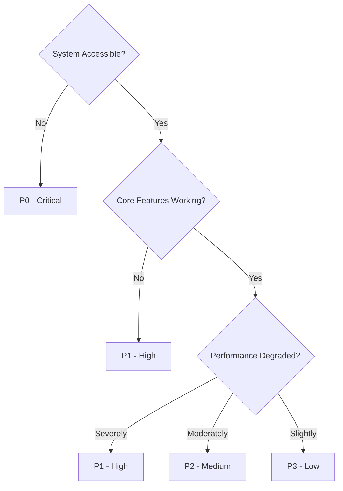
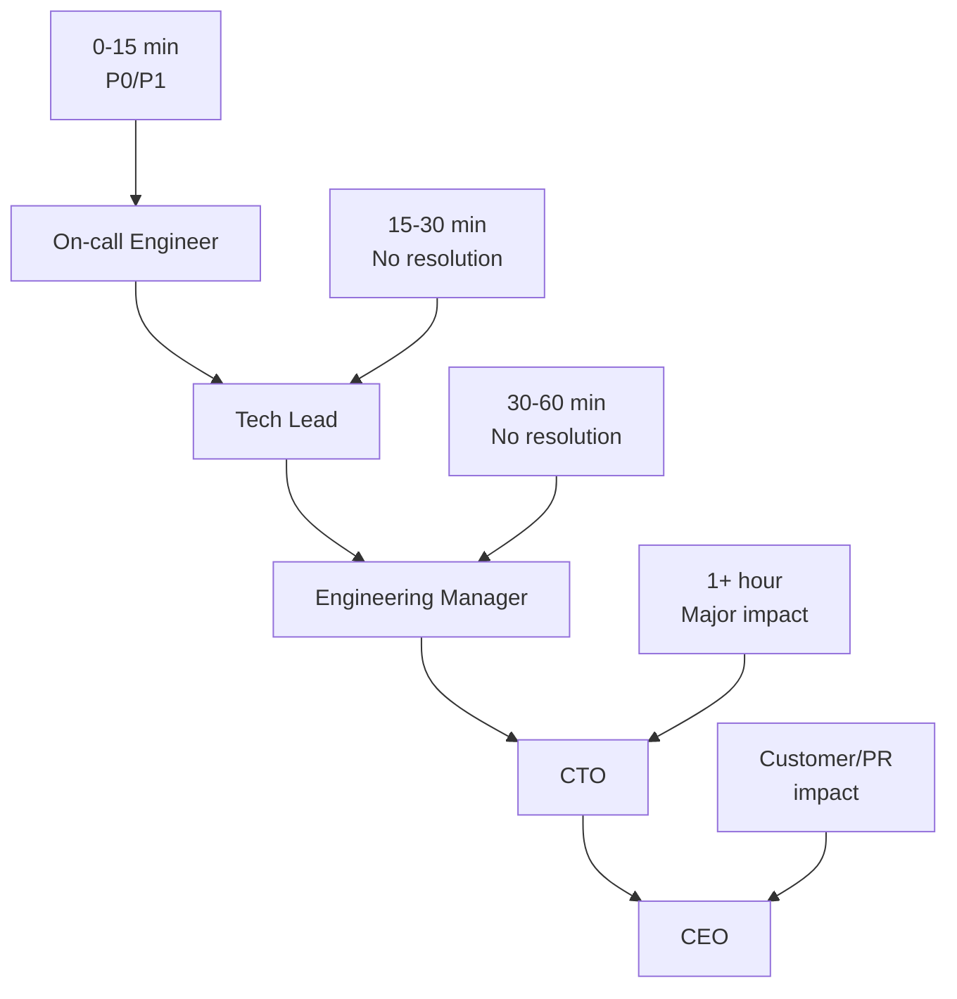

# Incident Response Procedure

*Last Updated: 2025-08-09*

## Overview
The incident response procedure ensures rapid, coordinated, and effective response to production issues affecting the Seiketsu AI platform, minimizing customer impact and ensuring system reliability.

## Incident Severity Classification

### Severity Levels
| Level | Impact | Response Time | Escalation | Examples |
|-------|--------|---------------|------------|----------|
| **P0 - Critical** | Complete system outage | Immediate | CEO + CTO | Platform down, data breach |
| **P1 - High** | Major feature broken | <15 minutes | CTO | Voice AI not working, login failures |
| **P2 - Medium** | Minor feature impact | <2 hours | Engineering Manager | Dashboard slow, minor UI bugs |
| **P3 - Low** | Cosmetic/enhancement | <24 hours | Team Lead | Typos, non-critical UI issues |

### Impact Assessment Matrix


## Incident Response Team Structure

### Core Response Team
```typescript
interface IncidentResponseTeam {
  incidentCommander: string;     // Overall coordination
  technicalLead: string;         // Technical resolution
  communicationLead: string;     // Stakeholder updates
  customerSuccess: string;       // Customer impact management
  subject matter experts: string[]; // Domain-specific expertise
}

// On-call rotation
const onCallRotation = {
  primary: 'alice.engineer@seiketsu.ai',
  secondary: 'bob.engineer@seiketsu.ai', 
  manager: 'charlie.manager@seiketsu.ai',
  week: '2025-W32'
};
```

### Escalation Chain


## Incident Response Workflow

### Phase 1: Detection and Initial Response (0-15 minutes)

#### Detection Methods
1. **Automated Monitoring**: Alerts from monitoring systems
2. **Customer Reports**: Support tickets or direct communication
3. **Team Discovery**: Engineers notice issues during development
4. **External Monitoring**: Third-party uptime monitoring

#### Initial Response Checklist
```markdown
## Immediate Actions (First 5 minutes)
- [ ] Acknowledge alert/report within 2 minutes
- [ ] Assess initial severity level
- [ ] Create incident ticket in Jira/PagerDuty
- [ ] Notify incident response team
- [ ] Begin initial investigation

## Assessment Actions (5-15 minutes)
- [ ] Confirm impact scope and affected users
- [ ] Verify system status dashboard accuracy
- [ ] Check recent deployments and changes
- [ ] Review monitoring graphs and logs
- [ ] Update severity level if needed
- [ ] Escalate if P0/P1 and no immediate fix
```

#### Incident Declaration
```bash
#!/bin/bash
# Incident declaration script

incident_id=$(date +"%Y%m%d-%H%M%S")
severity=$1
title="$2"

echo "Declaring incident: INC-${incident_id}"
echo "Severity: ${severity}"
echo "Title: ${title}"

# Create incident ticket
curl -X POST "https://api.seiketsu.ai/incidents" \
  -H "Authorization: Bearer ${API_TOKEN}" \
  -d "{
    \"id\": \"INC-${incident_id}\",
    \"severity\": \"${severity}\",
    \"title\": \"${title}\",
    \"status\": \"investigating\",
    \"created_at\": \"$(date -u +%Y-%m-%dT%H:%M:%SZ)\"
  }"

# Notify team
slack-notify "#incidents" "🚨 INCIDENT DECLARED: INC-${incident_id} (${severity}): ${title}"

# Page on-call for P0/P1
if [[ "$severity" =~ ^(P0|P1)$ ]]; then
  pagerduty-trigger "${incident_id}" "${severity}" "${title}"
fi
```

### Phase 2: Investigation and Mitigation (15 minutes - 2 hours)

#### Investigation Methodology
1. **Timeline Reconstruction**: What changed recently?
2. **Log Analysis**: Error patterns and anomalies
3. **Metrics Review**: Performance and availability data
4. **Component Testing**: Isolate failing systems
5. **Database Health**: Query performance and data integrity

#### Mitigation Strategies
```yaml
# Common mitigation playbooks
mitigation_strategies:
  high_error_rate:
    - check_recent_deployments
    - review_application_logs
    - consider_rollback
    - scale_infrastructure
  
  performance_degradation:
    - check_database_performance
    - review_cdn_status
    - analyze_traffic_patterns
    - optimize_slow_queries
  
  service_unavailable:
    - check_infrastructure_health
    - verify_dns_resolution
    - test_load_balancer_status
    - review_certificate_expiry
  
  voice_ai_failure:
    - check_elevenlabs_api_status
    - review_websocket_connections
    - test_audio_processing_pipeline
    - fallback_to_text_interface
```

#### Communication During Investigation
```markdown
## Internal Communication (Every 30 minutes for P0/P1)
**Slack Channel**: #incident-response
**Format**:
```
🔍 INCIDENT UPDATE - INC-20250809-1400
**Status**: Investigating
**Impact**: 15% of voice conversations failing
**Progress**: Identified issue with ElevenLabs API rate limiting
**Next Steps**: Implementing circuit breaker pattern
**ETA**: 30 minutes
**Need Help?**: Looking for backend engineer familiar with voice pipeline
```

## Customer Communication (For P0/P1)
**Channel**: Status page + Email + In-app notification
**Timeline**: Within 30 minutes of incident declaration
```

### Phase 3: Resolution and Recovery (Variable)

#### Resolution Verification Checklist
```markdown
## Technical Verification
- [ ] All monitoring alerts cleared
- [ ] Key user workflows tested manually
- [ ] Performance metrics back to baseline
- [ ] No error rate spikes in logs
- [ ] Database queries performing normally

## Business Verification  
- [ ] Customer success team confirms user reports stopped
- [ ] Key customers contacted and confirmed resolution
- [ ] Revenue-impacting features fully operational
- [ ] Support ticket volume returned to normal
```

#### Recovery Procedures
```python
# Automated recovery verification
import requests
import time
from typing import Dict, List

class RecoveryVerification:
    def __init__(self, incident_id: str):
        self.incident_id = incident_id
        self.checks = []
    
    def add_health_check(self, name: str, url: str, expected_status: int = 200):
        """Add a health check endpoint"""
        self.checks.append({
            'name': name,
            'url': url,
            'expected_status': expected_status
        })
    
    def verify_recovery(self) -> Dict:
        """Run all health checks and return results"""
        results = {
            'incident_id': self.incident_id,
            'timestamp': time.time(),
            'checks': [],
            'all_passed': True
        }
        
        for check in self.checks:
            try:
                response = requests.get(check['url'], timeout=10)
                passed = response.status_code == check['expected_status']
                
                results['checks'].append({
                    'name': check['name'],
                    'status': 'PASS' if passed else 'FAIL',
                    'response_time': response.elapsed.total_seconds(),
                    'status_code': response.status_code
                })
                
                if not passed:
                    results['all_passed'] = False
                    
            except Exception as e:
                results['checks'].append({
                    'name': check['name'],
                    'status': 'ERROR',
                    'error': str(e)
                })
                results['all_passed'] = False
        
        return results

# Usage example
verifier = RecoveryVerification('INC-20250809-1400')
verifier.add_health_check('API Health', 'https://api.seiketsu.ai/health')
verifier.add_health_check('Frontend', 'https://app.seiketsu.ai')
verifier.add_health_check('Voice Service', 'https://voice.seiketsu.ai/health')

recovery_status = verifier.verify_recovery()
print(f"Recovery verified: {recovery_status['all_passed']}")
```

### Phase 4: Post-Incident Activities (24-48 hours)

#### Incident Closure Checklist
```markdown
## Immediate Closure (Within 2 hours of resolution)
- [ ] All systems verified as stable
- [ ] Monitoring alerts configured to prevent recurrence
- [ ] Customer communication sent (resolution notification)
- [ ] Incident ticket updated with resolution details
- [ ] Team debriefing scheduled within 24 hours

## Short-term Follow-up (Within 24 hours)
- [ ] Post-incident review meeting scheduled
- [ ] Timeline documented in incident report
- [ ] Root cause analysis initiated
- [ ] Customer impact assessment completed
- [ ] Financial impact calculated (if applicable)

## Long-term Follow-up (Within 48 hours)
- [ ] Post-incident report published
- [ ] Action items created and assigned
- [ ] Process improvements identified
- [ ] Knowledge base updated
- [ ] Training needs assessed
```

## Communication Playbooks

### Internal Communication Templates

#### Slack Alert Template
```markdown
🚨 **INCIDENT ALERT** - INC-{incident_id}
**Severity**: {severity}
**Impact**: {impact_description}
**Status**: {current_status}
**Commander**: @{incident_commander}
**War Room**: {meeting_link}
**Updates**: This channel every 15min for P0/P1, 30min for P2

**Join the response**: {war_room_link}
```

#### Status Page Update Template
```markdown
**{timestamp} - Investigating**
We are currently investigating reports of {issue_description}. We will provide updates as we learn more.

**{timestamp} - Identified**
We have identified the issue with {component} and are working on a fix. Estimated resolution time is {eta}.

**{timestamp} - Monitoring**
A fix has been implemented and we are monitoring the results. All services should be operating normally.

**{timestamp} - Resolved**
This incident has been resolved. All services are operating normally. We will publish a post-incident report within 24 hours.
```

### Customer Communication

#### Email Notification Template
```html
<!DOCTYPE html>
<html>
<head>
    <title>Seiketsu AI Service Update</title>
</head>
<body>
    <h2>Service Update - {date}</h2>
    
    <p>Dear Valued Customer,</p>
    
    <p>We want to inform you about a service issue that may have impacted your experience with Seiketsu AI between {start_time} and {end_time} on {date}.</p>
    
    <h3>What Happened</h3>
    <p>{non_technical_explanation}</p>
    
    <h3>Impact</h3>
    <p>{customer_impact_description}</p>
    
    <h3>Resolution</h3>
    <p>{resolution_summary}</p>
    
    <h3>What We're Doing to Prevent This</h3>
    <ul>
        <li>{prevention_measure_1}</li>
        <li>{prevention_measure_2}</li>
        <li>{prevention_measure_3}</li>
    </ul>
    
    <p>We sincerely apologize for any inconvenience this may have caused. If you have any questions or concerns, please don't hesitate to contact our support team.</p>
    
    <p>Thank you for your patience and continued trust in Seiketsu AI.</p>
    
    <p>The Seiketsu AI Team</p>
</body>
</html>
```

## Monitoring and Alerting

### Alert Configuration
```yaml
# Prometheus alerting rules
groups:
- name: seiketsu-ai-critical
  rules:
  - alert: ServiceDown
    expr: up{job="seiketsu-api"} == 0
    for: 1m
    labels:
      severity: P0
    annotations:
      summary: "Seiketsu API service is down"
      description: "The Seiketsu API has been down for more than 1 minute"
      runbook: "https://docs.seiketsu.ai/runbooks/service-down"
  
  - alert: HighErrorRate
    expr: rate(http_requests_total{status=~"5.*"}[5m]) > 0.1
    for: 5m
    labels:
      severity: P1
    annotations:
      summary: "High error rate detected"
      description: "Error rate is {{ $value }} errors per second"
      runbook: "https://docs.seiketsu.ai/runbooks/high-error-rate"
  
  - alert: VoiceServiceLatency
    expr: histogram_quantile(0.95, rate(voice_processing_duration_seconds_bucket[5m])) > 2
    for: 10m
    labels:
      severity: P1
    annotations:
      summary: "Voice service latency is high"
      description: "95th percentile latency is {{ $value }} seconds"
      runbook: "https://docs.seiketsu.ai/runbooks/voice-latency"
```

### Runbook Integration
```markdown
# Service Down Runbook

## Immediate Actions
1. Check AWS service health dashboard
2. Verify load balancer status
3. Check application logs for errors
4. Restart application if no obvious cause

## Investigation Steps
1. Review recent deployments
2. Check database connectivity
3. Verify DNS resolution
4. Analyze traffic patterns

## Escalation
- If service not restored within 15 minutes, escalate to on-call manager
- If database issue suspected, page DBA
- If infrastructure issue, page DevOps team
```

## Incident Metrics and Reporting

### Key Performance Indicators
```sql
-- Incident metrics dashboard
WITH incident_stats AS (
  SELECT 
    DATE_TRUNC('month', created_at) as month,
    severity,
    COUNT(*) as incident_count,
    AVG(EXTRACT(EPOCH FROM (resolved_at - created_at))/60) as avg_resolution_time_minutes,
    AVG(EXTRACT(EPOCH FROM (first_response_at - created_at))/60) as avg_response_time_minutes
  FROM incidents 
  WHERE created_at >= NOW() - INTERVAL '12 months'
    AND resolved_at IS NOT NULL
  GROUP BY month, severity
)
SELECT 
  month,
  severity,
  incident_count,
  ROUND(avg_resolution_time_minutes::numeric, 2) as avg_resolution_minutes,
  ROUND(avg_response_time_minutes::numeric, 2) as avg_response_minutes
FROM incident_stats
ORDER BY month DESC, severity;
```

### Target SLA Metrics
- **P0 Response Time**: <2 minutes
- **P1 Response Time**: <15 minutes  
- **P2 Response Time**: <2 hours
- **P0 Resolution Time**: <1 hour
- **P1 Resolution Time**: <4 hours
- **Customer Satisfaction**: >95% satisfied with incident handling

### Monthly Incident Report
```typescript
interface IncidentReport {
  month: string;
  totalIncidents: number;
  incidentsBySevirity: Record<string, number>;
  averageResolutionTime: Record<string, number>;
  topRootCauses: string[];
  preventionMeasuresImplemented: string[];
  customerImpactHours: number;
  mttr: number; // Mean Time To Recovery
  mtbf: number; // Mean Time Between Failures
}
```

## Post-Incident Review Process

### Review Meeting Agenda
```markdown
# Post-Incident Review - INC-{incident_id}
**Date**: {review_date}
**Duration**: 60 minutes
**Attendees**: Incident response team + stakeholders

## Agenda
1. **Timeline Review** (15 min)
   - Incident detection to resolution
   - Key decisions and actions taken
   - Communication timeline

2. **What Went Well** (10 min)
   - Effective actions and processes
   - Good team coordination
   - Successful mitigation strategies

3. **What Could Be Improved** (15 min)
   - Gaps in process or tools
   - Communication issues
   - Detection delays

4. **Root Cause Analysis** (15 min)
   - Technical root cause
   - Process failures
   - Human factors

5. **Action Items** (5 min)
   - Prevention measures
   - Process improvements
   - Tool enhancements
   - Training needs
```

### Action Item Tracking
```yaml
# Post-incident action items
action_items:
  - id: "AI-001"
    title: "Implement circuit breaker for ElevenLabs API"
    owner: "backend-team"
    priority: "high"
    due_date: "2025-08-16"
    status: "in_progress"
    
  - id: "AI-002"
    title: "Add alerting for API rate limit approaching"
    owner: "devops-team"
    priority: "medium"
    due_date: "2025-08-20"
    status: "todo"
    
  - id: "AI-003"
    title: "Update incident response training materials"
    owner: "engineering-manager"
    priority: "low"
    due_date: "2025-08-30"
    status: "todo"
```

## Training and Preparedness

### Incident Response Training Program
1. **New Hire Orientation**: Incident response overview (1 hour)
2. **Quarterly Drills**: Simulated incidents (2 hours)
3. **Annual Training**: Deep dive on tools and processes (4 hours)
4. **On-call Training**: Specific to on-call engineers (8 hours)

### Game Day Exercises
```markdown
# Monthly Game Day Scenario
**Scenario**: ElevenLabs API is experiencing intermittent failures
**Objectives**: 
- Test incident detection and escalation
- Verify communication procedures
- Practice mitigation strategies
- Test monitoring and alerting

**Success Criteria**:
- Incident detected within 5 minutes
- Team assembled within 10 minutes
- Mitigation implemented within 30 minutes
- Clear communication maintained throughout
```

This incident response procedure ensures Seiketsu AI can quickly detect, respond to, and recover from service disruptions while learning from each incident to improve system reliability.
